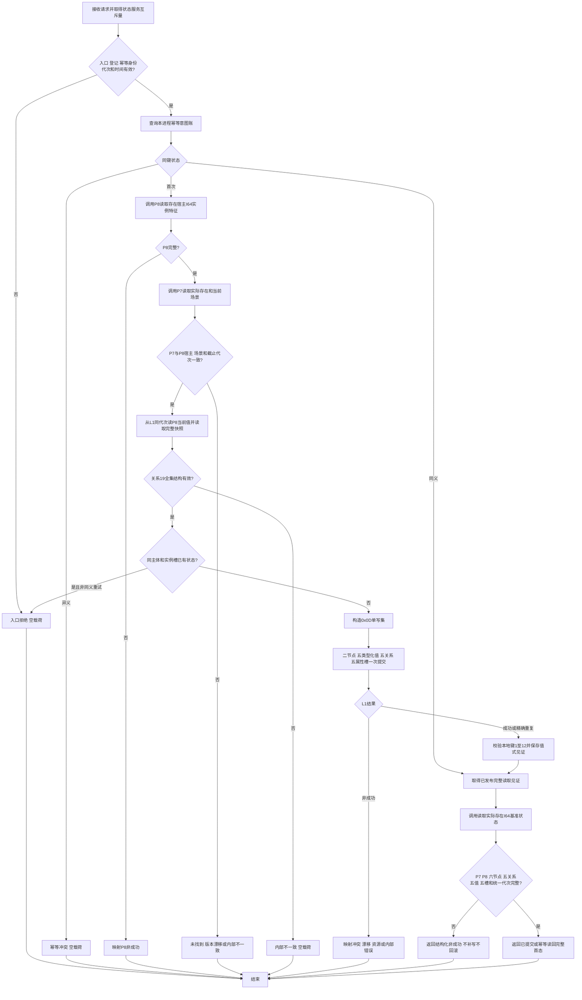

# 发布实际存在 I64 首个关系19基准状态函数流程图 v0.1

对应函数：

```cpp
实际存在I64基准状态结果 L1状态服务::发布实际存在I64首个基准状态(
    const 实际存在I64首个基准状态发布请求& 请求);
```



边界：角色4目标是状态域特征值见证节点，不是 P8 L1 值事实；首态不调用 P6、不建立关系20、迁移动能、动作动态、来源动作或因果。
