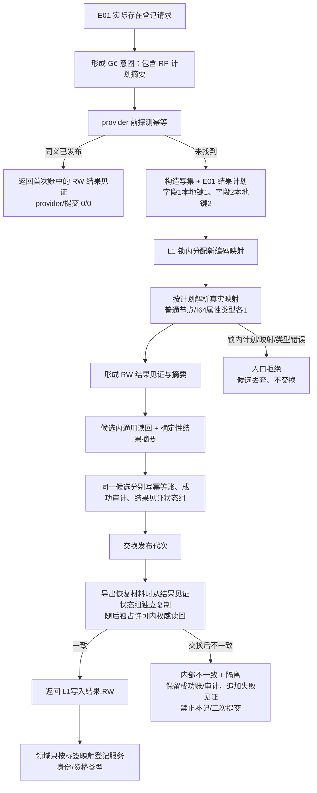
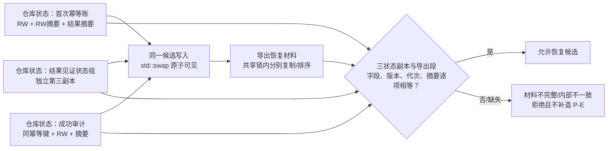

# L1-SIMPLIFY-P15 E01 结果见证持久化流程图 v0.24

更新时间：2026-08-06
依据：P15 v0.24 详细设计；正式基线 `d643c3d6ed84687c13628df047fcfde2af22bf71`。

## 方案 A：计划前置、映射内生、同一候选落账



## 状态三副本与恢复导出



## E01 固定向量

```text
计划头：0x15000301 / 合同1 / 规则1 / 变体1；凭证领域结果计划摘要 = RP摘要
字段1：标签0x00000001，写集本地键1，节点种类::普通，optional标记0
字段2：标签0x00000002，写集本地键2，节点种类::属性类型，optional标记1，值表示种类::I64
RP 摘要：原始ASCII HZY-L1-RP → 大端 U32/U64/U8，optional 0/1 后才写值
RW 摘要：原始ASCII HZY-L1-RW → 大端 U32/U64/U8，optional 0/1 后才写值，再写稳定编码
```

v1 C++ 字段只允许节点：`节点种类` + `std::optional<值表示种类>`；枚举序列化为现有 underlying U8。RP 的完整字节序为原始 ASCII `HZY-L1-RP`、大端 U32 格式/标签/合同/规则、U8 变体、大端 U64 字段数，再逐字段写 U32 标签、U32 本地键、U8 节点种类、U8 optional 标记，标记为 1 才写 U8 值表示种类。RW 在同一前缀和头后继续写大端 U64 发布代次、U64 幂等键、U64 字段数，再逐字段写标签、本地键、节点种类、optional 标记/可选值和 U64 稳定编码；无长度、NUL、填充或隐式 variant。

请求意图只绑定计划，不含未来稳定编码；结果见证只接受本次映射。X01 命中首次账直接读回，X02 在唯一共享 `0x15000901` 点完成首次提交；v0.23 的 16/50→16/49 与 32+18=50 分账不改变。
