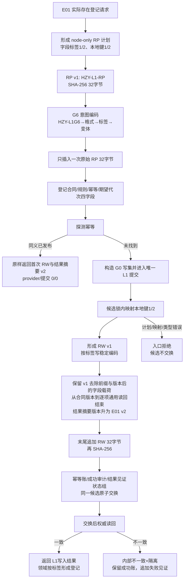
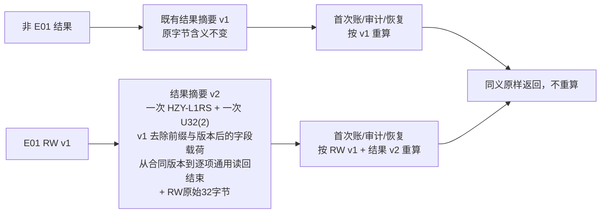

# L1-SIMPLIFY-P15 E01 RP/RW 摘要互证流程图 v0.25

更新时间：2026-08-06
依据：P15 v0.25 详细设计；正式基线 `051d95e23924b8c193340a051df5abc448ec9cfd`。

## G6 首次路径与唯一摘要位置



## 结果摘要版本分流



## 固定字节向量

```text
RP："HZY-L1-RP"→BE U32(1,0x15000301,1,1)→BE U8(1)→BE U64(2)
  →(BE U32标签1,U32键1,U8普通,U8 0)
  →(BE U32标签2,U32键2,U8属性类型,U8 1,U8 I64)→SHA-256
G6："HZY-L1G6"→BE U32(1)→BE U32(0x15000301)→U8(1)
  →RP原始32字节→BE U32合同→BE U32规则→BE U64幂等→BE U64代次→SHA-256
RW："HZY-L1-RW"→BE U32(1)→BE U32(0x15000301)→BE U32合同→BE U32规则→U8(1)
  →BE U64代次→BE U64幂等→BE U64(2)→逐字段标签/键/种类/optional/编码→SHA-256
结果 v2：只出现一次 "HZY-L1RS"→只出现一次 BE U32(2)
  →v1 去除前缀与版本后的字段载荷（从合同版本到逐项通用读回结束）
  →RW原始32字节→SHA-256；绝不嵌套 v1 前缀/U32(1)
```

RP 不得在 G6 中重复或移位；RW 不进入 G0、RP 或请求意图编码第二次。交换前任何摘要/版本不一致固定入口拒绝，交换后权威读回不一致固定隔离。
