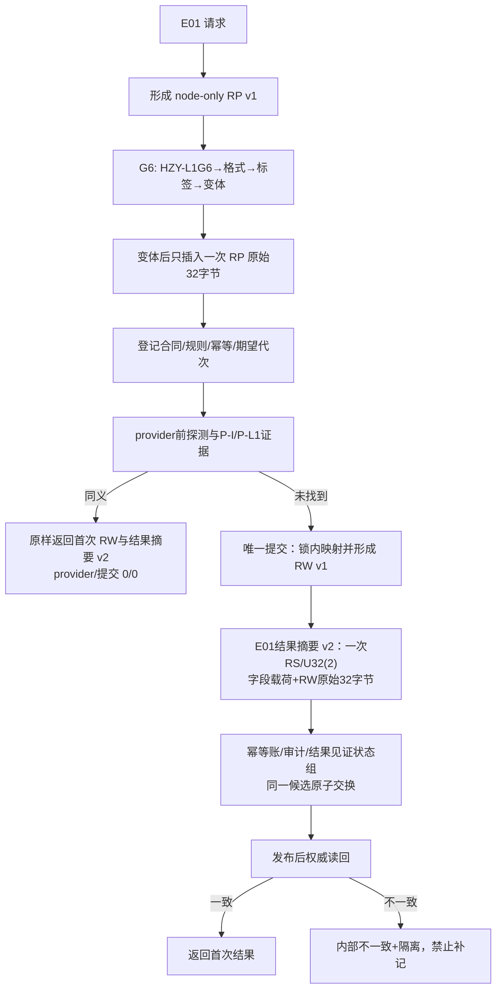
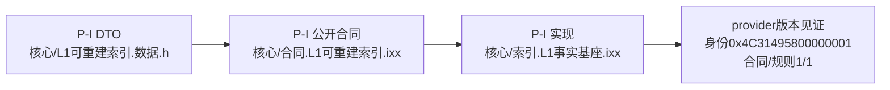

# L1-SIMPLIFY-P15 E01 RP/RW 与 P-I 白名单流程图 v0.26

更新时间：2026-08-06
依据：P15 v0.26 详细设计；正式基线 `8ae301b85a8b02bba38c9e66cad60f6e9c707c1a`。

## P-I 合同所有权

P-I 合同声明路径是 24 项代码白名单中的第 24 项，不能从清单删除或改由实现文件承担。完整范围仍为 24 项代码路径 + 2 条记录 = 26 文件；不新增调用点。RP/RW/v1/v2 字节顺序、同义原样返回和恢复按版本重算均继承 v0.25。
