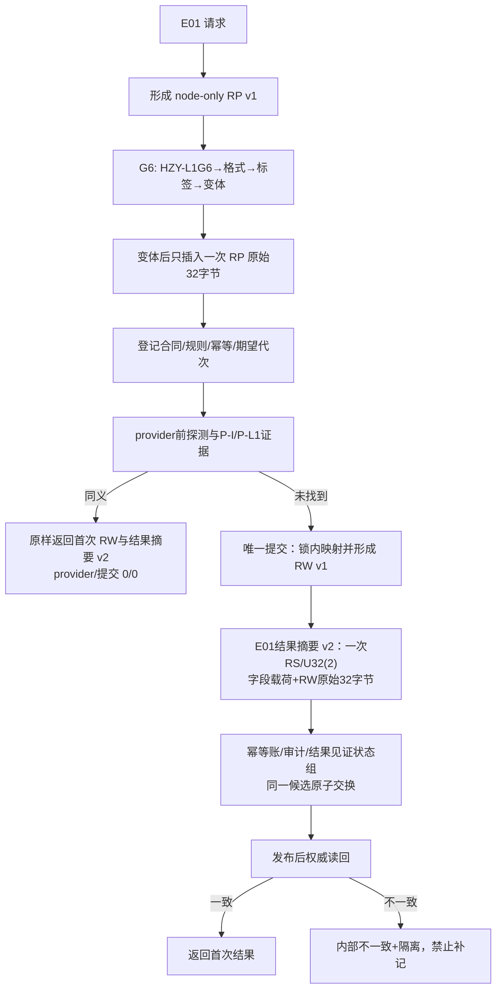
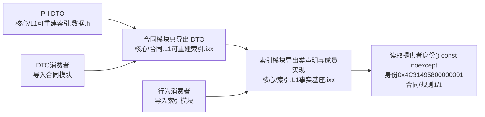

# L1-SIMPLIFY-P15 E01 RP/RW 与 P-I 模块归属流程图 v0.27

更新时间：2026-08-06
依据：P15 v0.27 详细设计；正式基线 `45304d10c0c3d49728b03bacb7d327185e25c2c6`。

## P-I 物理所有权

`合同.L1可重建索引.ixx` 不声明 `L1事实可重建索引` 的成员；类声明和实现同归 `索引.L1事实基座.ixx`，不使用 PIMPL、自由函数或新旁路接口。24 项代码路径 + 2 条记录仍为完整范围；RP/RW/v1/v2 字节顺序、同义原样返回和恢复按版本重算均继承 v0.26。
