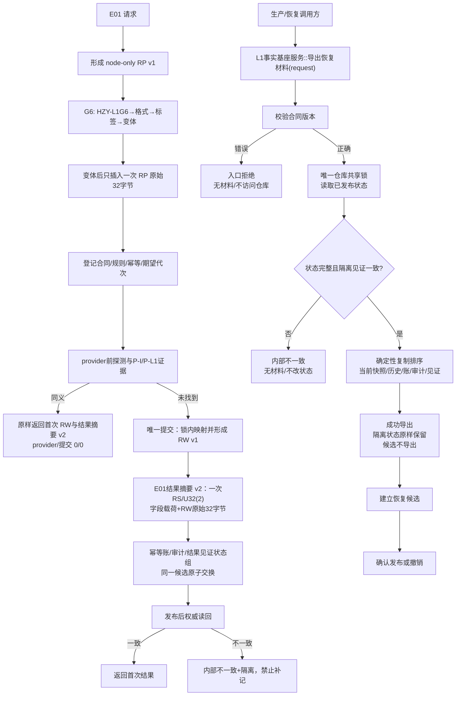
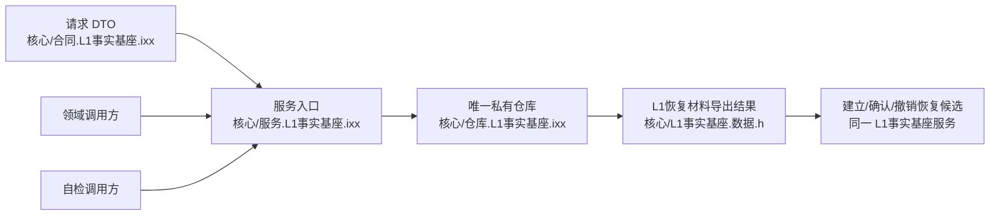

# L1-SIMPLIFY-P15 E01 RP/RW、P-I 与恢复导出服务流程图 v0.28

更新时间：2026-08-06
依据：P15 v0.28 详细设计；正式基线 `23957f3954d4b19826f67fb930cdd578b1ba82f2`。

## 恢复导出物理所有权

合同版本错误在服务层拒绝；仓库只读共享锁覆盖校验、复制和排序；隔离但完整时成功返回并保留见证；不完整或见证矛盾时内部不一致；不导出未确认候选，不允许外部仓库旁路。
