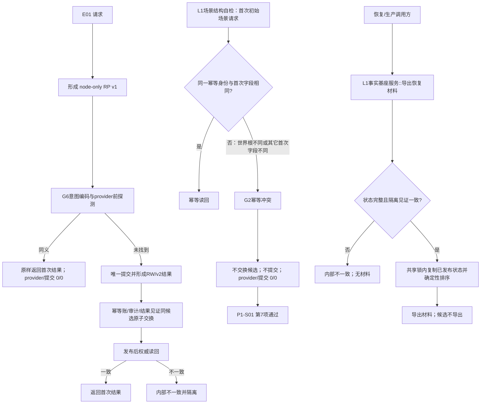

# L1-SIMPLIFY-P15 E01、G2 自检与恢复导出流程图 v0.29

更新时间：2026-08-06

依据：P15 v0.29 详细设计；正式基线 `57c2c08407f9ca0f18d679dcb4777d634846afe8`。

G2 异义分支只验证既有正式合同，不新增生产写入或第二解释者；旧自检第 7 项的
期望必须是 `幂等冲突`。恢复导出路径、RP/G6/RW/v1/v2 和其它 v0.28 分支保持不变。
