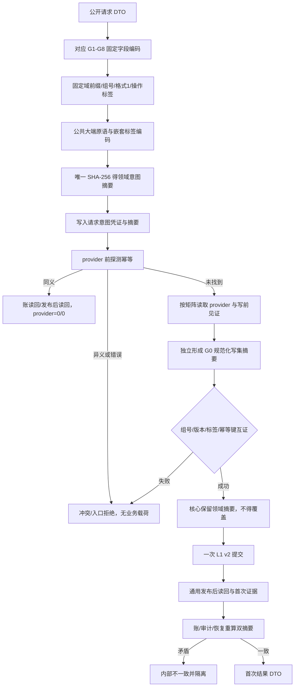
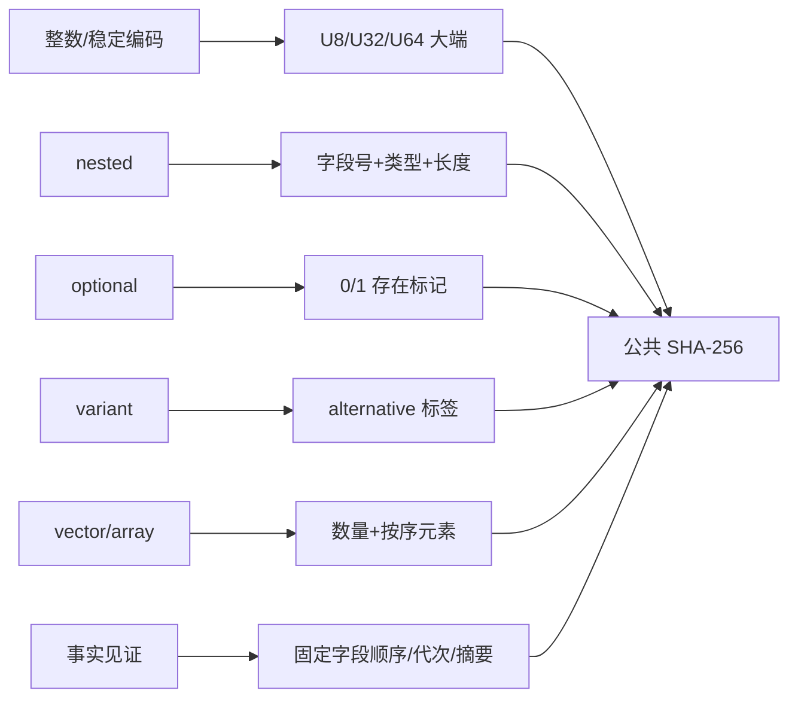
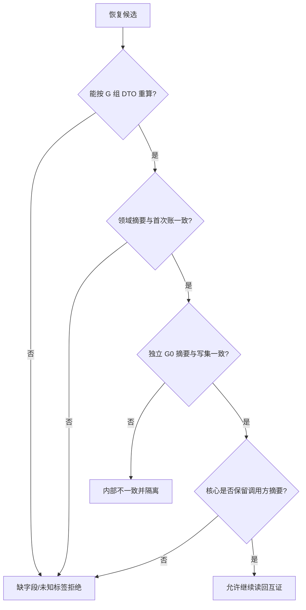

# L1-SIMPLIFY-P15 G1—G8 领域意图编码与 G0 互证函数流程图 v0.16

更新时间：2026-08-06

依据：P15 v0.16 详细设计；正式 HEAD `9ec7a17dbacc0912b9bd31c2f3168a54c53d6709`。本图是待施工合同，不是现状实现图。

## 唯一函数和物理位置

```text
公共原语/哈希：核心/L1事实基座.数据.h :: L1确定性编码内部
G1：领域/服务.世界登记.ixx
G2：领域/服务.L1场景结构.ixx
G3：领域/服务.L1特征定义.ixx
G4：领域/服务.L1实例特征.ixx
G5/G0：核心/L1事实基座.数据.h
G6：领域/服务.L1实际存在.ixx（组合服务只转发）
G7：领域/服务.L1状态.ixx
G8：领域/服务.特征比较.ixx
核心互证：核心/服务.L1事实基座.ixx + 核心/L1事实基座.数据.h
```

各 G 函数不接受自由操作标签；标签、域前缀、格式版本和字段顺序均由固定重载绑定。核心不得从 G0 写集覆盖调用方的领域摘要。

## 主流程



## 编码分支



## 拒绝路径和静态门禁



静态门禁仍为 32/32 生产、18/18 自检、32→50、16 文件/50 物理点、24 文件白名单；需另外覆盖 8 组字段矩阵、函数物理位置、固定标签、测试向量及 G0 不覆盖。
