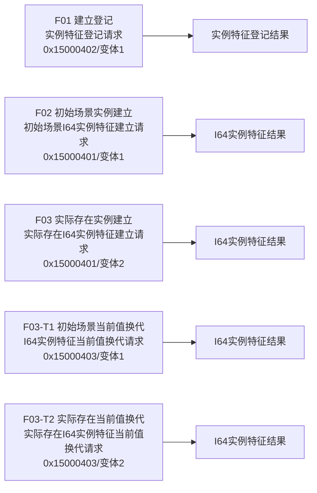
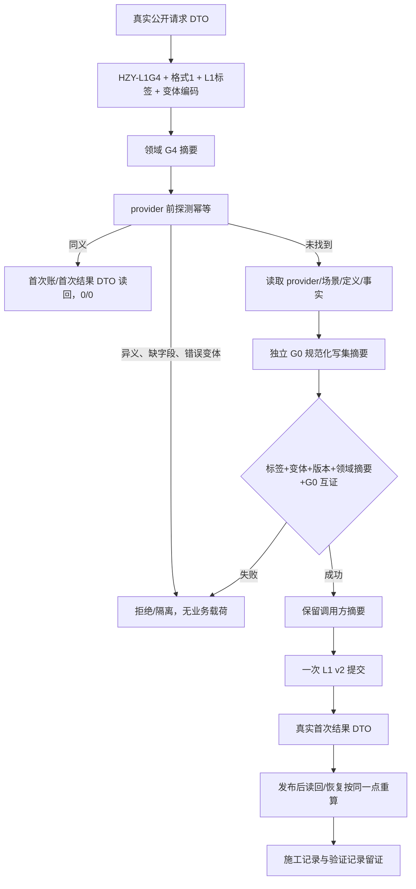

# L1-SIMPLIFY-P15 G4 实例特征入口与摘要互证函数流程图 v0.20

更新时间：2026-08-06

依据：P15 v0.20 详细设计；正式 HEAD `9c09dd4ea186d38f3e2d77ecbb2915e4bf82329d`。

本图冻结真实入口、共享标签变体、provider 前探测顺序和 24+2=26 允许范围；不证明代码已经实现。

## G4/F01/F02/F03 矩阵

## 统一执行顺序

0x15000401 的 F02/F03、0x15000403 的 F03-T1/F03-T2 共享底层标签但不共享领域操作身份；变体是摘要字段，不是新增 L1 标签。F02 首次结果绝不映射为 `实例特征登记结果`。

## 范围门禁

24 项代码/模块/自检白名单沿用 v0.19，另有两条专属记录路径 `施工记录/20260806_L1-SIMPLIFY-P15-POST-PUBLISH-READBACK_施工记录.md`、`验证记录/20260806_L1-SIMPLIFY-P15-POST-PUBLISH-READBACK_验证记录.md`，完整允许范围为 26 文件；除两条记录外不得新增文件。G1—G3、G5—G8、G0、P-L1/P-I/P-S、32/18/50 和 16/50 保持不变。
