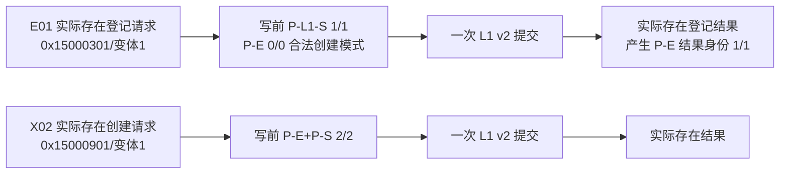
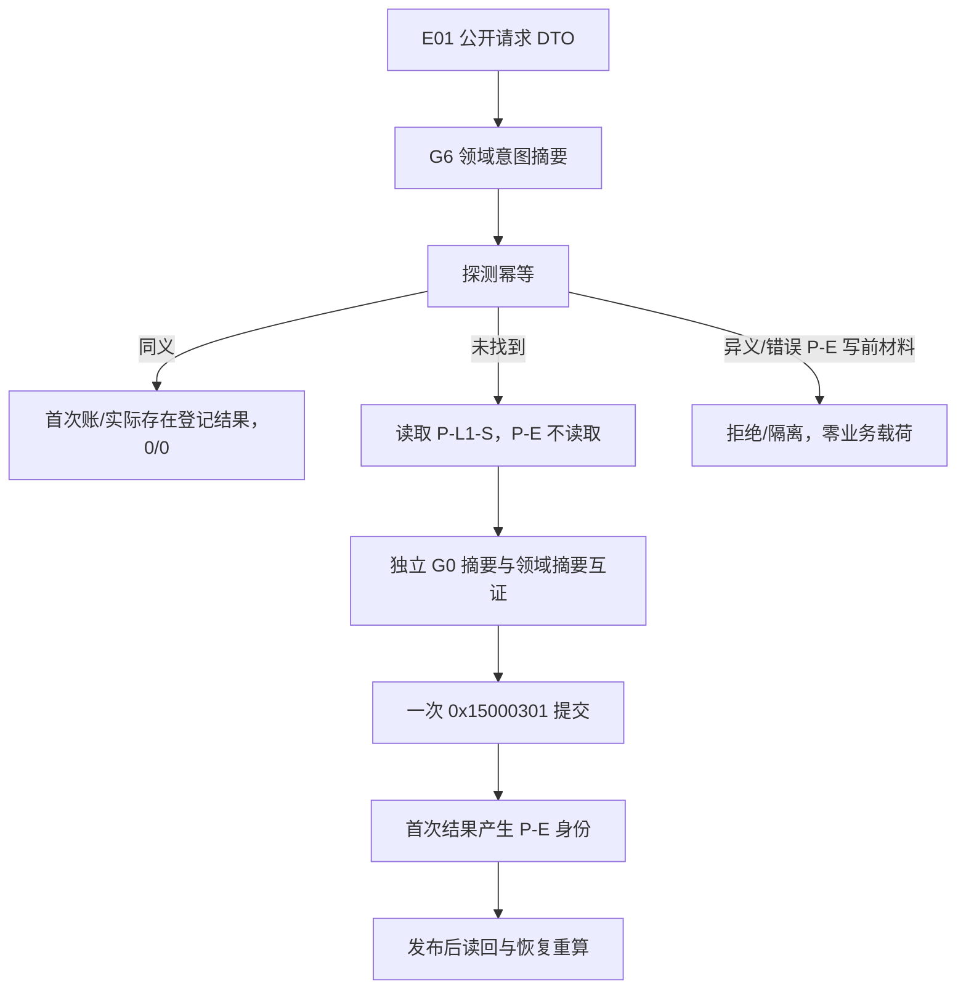

# L1-SIMPLIFY-P15 G6 E01 身份循环与证据互证流程图 v0.22

更新时间：2026-08-06
依据：P15 v0.22 详细设计；正式基线 `11c0ee5e4f9e7154e4ea6bf43458c9e44c66c2ea`。

## E01/X02 证据模式

## E01 顺序与恢复拒绝

E01 的 P-E 是创建结果身份，不是提交前 provider。X02 继续在 provider 前读取 P-E/P-S 并保持 2/2；两种模式不可互换。完整范围仍为 24 项代码/模块/自检加两条专属记录路径，共 26 文件。
