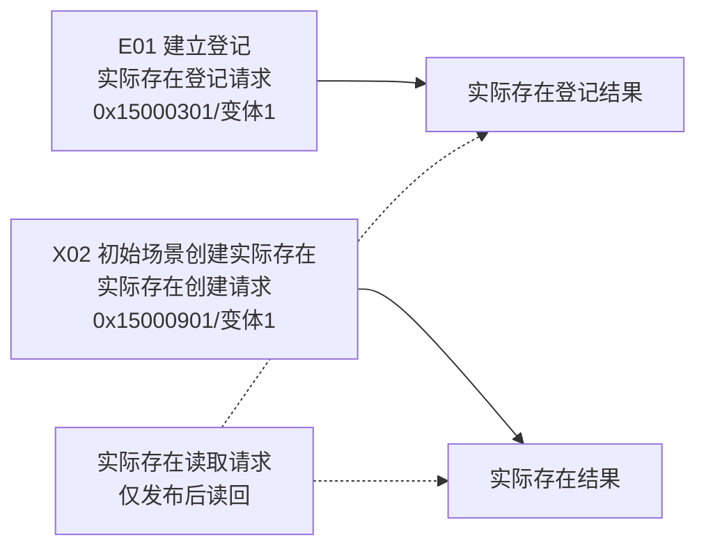
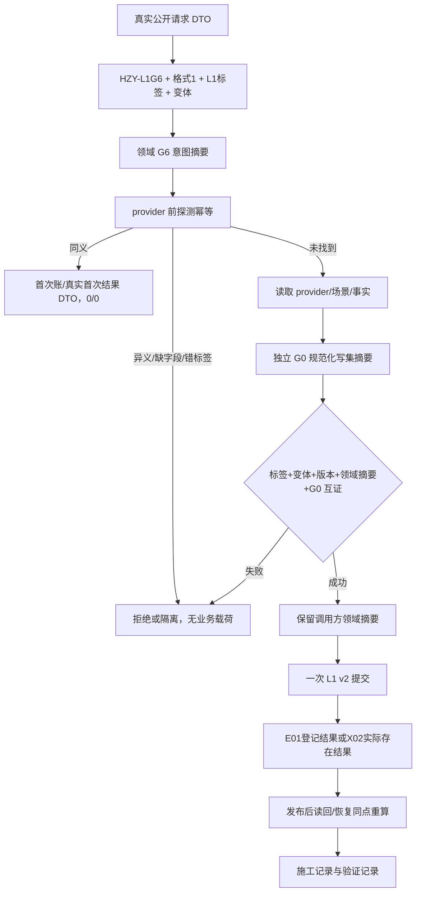

# L1-SIMPLIFY-P15 G6 实际存在入口与摘要互证流程图 v0.21

更新时间：2026-08-06
依据：P15 v0.21 详细设计；正式创建基线 `1a8acf9fa16cb8ffa0032f8b0011354f86f48d03`。

本图只修订 G6/E01/X02 的真实入口矩阵，不证明代码已经实现。

## 真实入口矩阵

## 统一执行顺序

E01 不得改用 `实际存在读取请求` 或 X02 请求；X02 不得改用读取 DTO 或 E01 登记结果。两点的标签、变体和首次结果在账、审计、读回及恢复中保持同一身份。

## 范围门禁

24 项代码/模块/自检白名单加两条专属记录路径构成完整 26 文件范围；除两记录外不得新增文件。G1—G5/G7—G8、G0、P-L1/P-I/P-S、32/18/50、16/50 保持不变。
