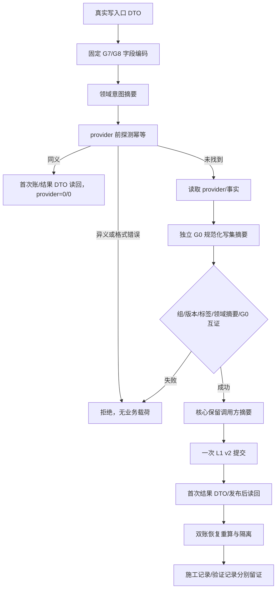
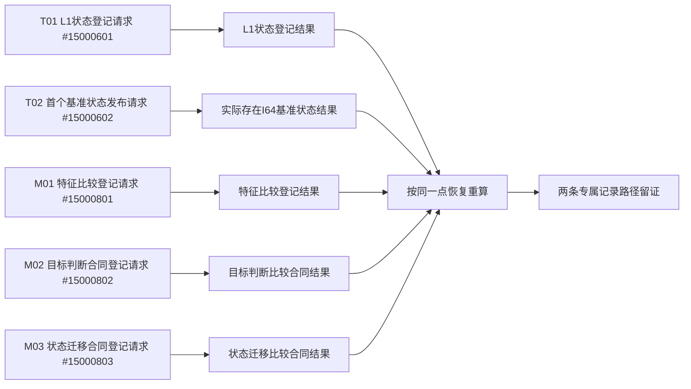

# L1-SIMPLIFY-P15 G7/G8 代码实施授权与摘要互证函数流程图 v0.19

更新时间：2026-08-06

依据：P15 v0.19 详细设计；正式 HEAD `7681de05877dc4aebdac3a1300323c80ecc84c3f`。

本图冻结执行目标、26 文件允许范围和两条专属记录路径；代码是否已实现只由执行侧正式验证证明。

## 权限与范围

```text
计划可执行 + S0 通过
  -> 允许在24项代码/模块/自检白名单内施工
  -> 允许写施工记录/20260806_L1-SIMPLIFY-P15-POST-PUBLISH-READBACK_施工记录.md
  -> 允许写验证记录/20260806_L1-SIMPLIFY-P15-POST-PUBLISH-READBACK_验证记录.md
  -> 完整允许范围=24项代码/模块/自检+2条记录=26文件
  -> 除上述两条记录外禁止新增文件；禁止白名单外、P0-FIX、路线、旧WORLD-TREE、P63/P64及异主WIP
```

## G7/G8 施工主流程



## 入口映射



G1—G6、公共编码、G0 互证、P-L1/P-I/P-S、32/18/50、16/50 和 24 项代码白名单保持 v0.18；本图新增的两条记录只承载施工/验证证据，不改变机器合同。
