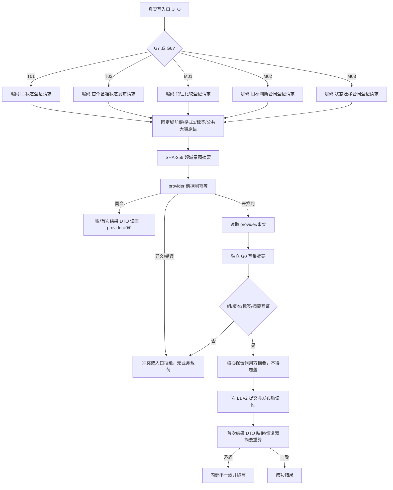
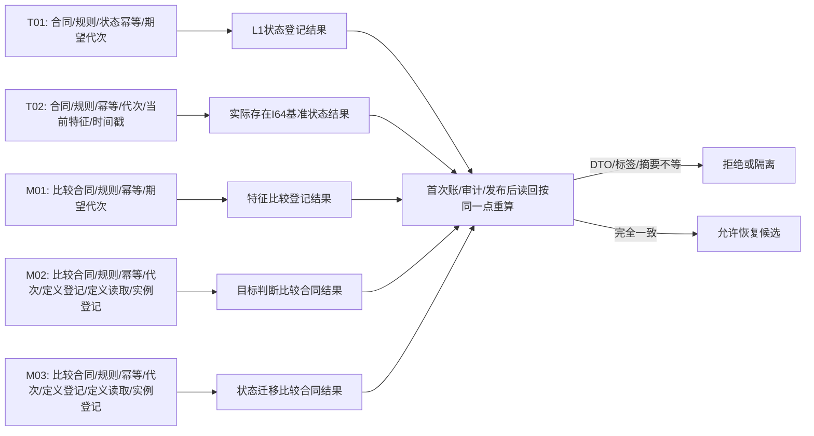

# L1-SIMPLIFY-P15 G7/G8 真实写入口意图预探测与 DTO 互证函数流程图 v0.17

更新时间：2026-08-06

依据：P15 v0.17 详细设计；正式 HEAD `aaf7558116d692c336b618d9de607da93d221a5c`。本图是待施工合同，不是现状实现图。

## 真实入口绑定

```text
T01 领域/服务.L1状态.ixx::建立登记(L1状态登记请求)                         #0x15000601
T02 领域/服务.L1状态.ixx::发布实际存在I64首个基准状态(实际存在I64首个基准状态发布请求) #0x15000602
M01 领域/服务.特征比较.ixx::建立登记(特征比较登记请求)                       #0x15000801
M02 领域/服务.特征比较.ixx::登记I64目标判断比较合同(I64目标判断比较合同登记请求)     #0x15000802
M03 领域/服务.特征比较.ixx::登记I64状态迁移比较合同(I64状态迁移比较合同登记请求)     #0x15000803
```

## 主流程



## G7/G8 字段和恢复分支



M02/M03 虽然嵌套字段形状相近，固定标签不同且摘要不同；读取合同 DTO 和业务比较 DTO 不进入首次写意图编码。

## 验证门禁

机械验证 T01/T02/M01/M02/M03 的入口签名、固定标签、字段序列、结果 DTO、同义/异义向量和恢复拒绝；G1—G6、32/18/50、16/50、24 文件及 G0 独立互证保持 v0.16。
