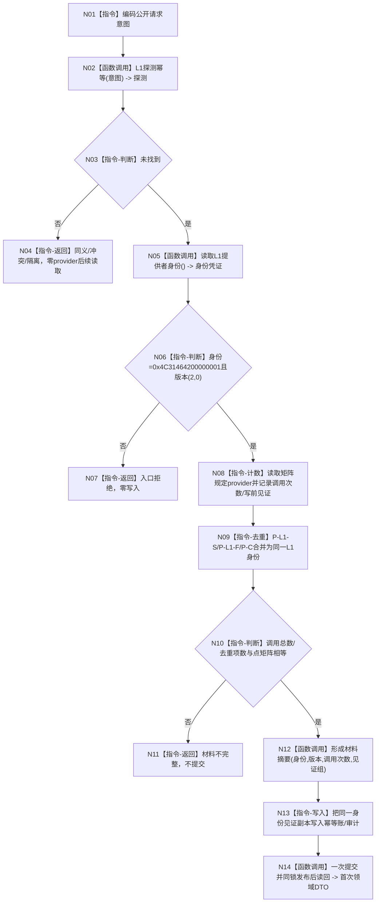

# L1-SIMPLIFY-P15 provider 身份与证据计数函数流程图 v0.14

更新时间：2026-08-06

依据：P15 v0.14 详细设计；执行 WIP 的 L1 v2 合同；正式 HEAD `7b3f39087f955fed3f26595467ccaa832fd0592d`。本图是目标施工图，不是现状实现图。

## 函数合同

根函数：`L1提交内通用发布后读回服务::形成首次执行证据`

目标接口：`L1事实基座服务::读取提供者身份() const noexcept`、`L1事实基座服务::探测幂等(...)`、`L1事实基座服务::提交写集(..., 操作标签)`。

返回：结构化证据材料或材料不完整/入口拒绝；不改变事实代次。

## 流程图

## 关键边界

身份读取是不可变合同读取，不是事实 provider 调用；矩阵中的 provider 调用计数从实际读取函数开始计。P-C 不得生成独立身份；恢复只接受统一 L1 身份和 `(2,0)` 版本。

## 验证

验证 Mermaid fenced block、单一根函数、身份/版本/计数分支完整，并分别核对 32/32 生产/业务场景行、18/18 自检调用行、32→50 映射和 50/50 物理调用点；运行 `git diff --check` 和 strict。不得据本图宣称代码、构建或恢复运行通过。
