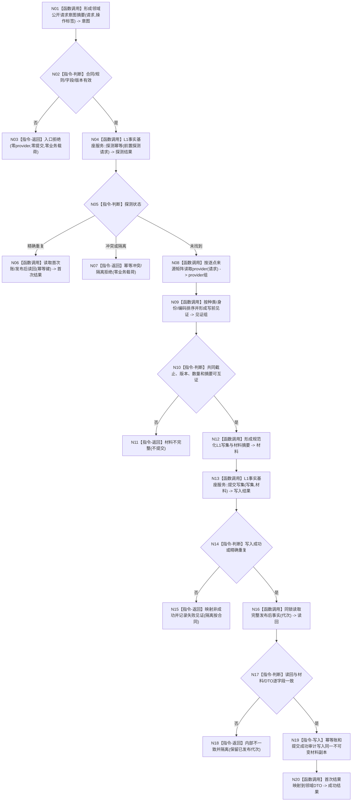

# L1-SIMPLIFY-P15 预探测、证据组装与发布后读回函数流程图 v0.13

更新时间：2026-08-06

依据：P15 v0.13 详细设计；规范 4015 §4；正式 HEAD `b3f19edd755b56b21b78726b8b36221397da543e`。本图是目标施工图，不是当前实现图；正式 HEAD 当前没有领域 `.探测幂等(` 调用和结构化证据组。

## 身份与边界

根函数：`L1提交内通用发布后读回服务::执行领域写入`

归属：P15 允许的领域调用点与 L1 中性服务；现有或待新增接口由详细设计 §2、§4 冻结。

参数：领域公开请求、业务操作身份、领域 DTO 映射器；所有权由调用方持有，函数只读入并形成不可变材料。

返回：首次成功/精确重复返回对应领域 DTO；入口拒绝、幂等冲突、材料不完整、事实代次漂移、内部不一致和隔离拒绝返回结构化非成功且零业务载荷（恢复发布例外见设计 §5）。

## 流程图

## 节点合同

| 节点 | 输入/输出绑定 | 事实读写 | 验证 |
| --- | --- | --- | --- |
| N01 | 公开 DTO + 唯一标签 -> 意图摘要 | 只读请求字段 | G1—G8 字段矩阵 |
| N04 | L1 前置探测请求 -> 探测状态 | 幂等账只读 | provider 调用数为0 |
| N08-N09 | 逐点 P/N 来源 -> 有序组 | provider/当前事实只读 | 数量、版本、截止、排序 |
| N13 | 中性写集+材料 -> L1写入结果 | 单次原子提交 | 同锁一次 |
| N16 | 发布代次 -> 完整读回 | 当前事实只读 | 代次和逐字段互证 |
| N19-N20 | 材料/读回 -> 审计、领域结果 DTO | 两账不可变副本 | 首次/同义/异义矩阵 |

## 关键边界

provider 读取不得先于 N04；不得以摘要反推 provider；W01/D01 只能走模式3；除 W01/D01 的 G1—G8 必须走模式2且按矩阵形成两组。当前正式代码尚未实现这些节点，图只作为 v0.13 施工合同。

## 验证

确认 Mermaid fenced block、单一根函数、每个调用节点具名；运行 `git diff --check -- <本文件>` 与 strict。不得据本图宣称代码、构建、完整自检或恢复运行通过。
