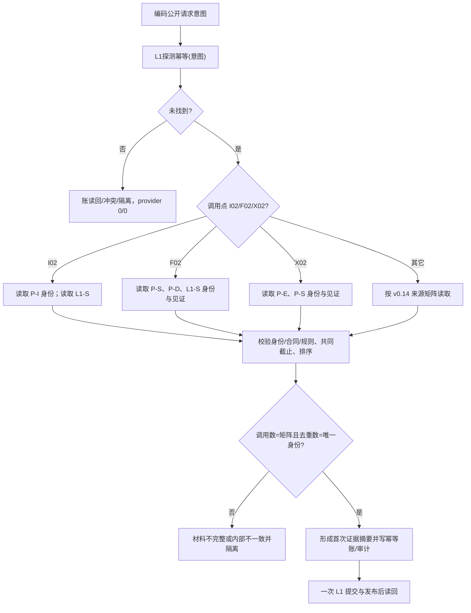

# L1-SIMPLIFY-P15 非 L1 provider 身份与计数函数流程图 v0.15

更新时间：2026-08-06

依据：P15 v0.15 详细设计；正式 HEAD `c7366e7b77842cd2a65af866509dfc3081ea269f`。本图是目标施工图，不是现状实现图。

## 函数合同

根函数：`L1提交内通用发布后读回服务::形成首次执行证据`

新增只读入口：`L1事实可重建索引::读取提供者身份() const noexcept`、`L1场景结构服务::读取提供者身份() const noexcept`。它们分别返回 P-I `(0x4C31495800000001,1,1)` 与 P-S `(0x4C31534300000001,2,1)`；L1 provider 仍返回 `(0x4C31464200000001,2,0)`。

## 流程图

身份读取只产生合同见证，不改变事实代次；同一 provider 的多次读取按稳定身份去重，但调用次数保留。身份缺失、版本错、伪造来源、材料字段缺失或恢复重算不等均拒绝；本图不证明实现、构建或运行验证。

## 验证

机械核对 I02 `2/2`、F02 `3/3`、X02 `2/2`，并核对总计 32/32 生产/业务、18/18 自检、50/50 物理调用、16 个调用文件；验证 P-I/P-S 物理位置与 24 文件白名单。运行 `git diff --check` 和 strict；不把文档门禁升级为代码能力。
