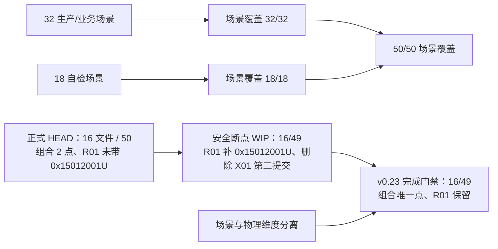
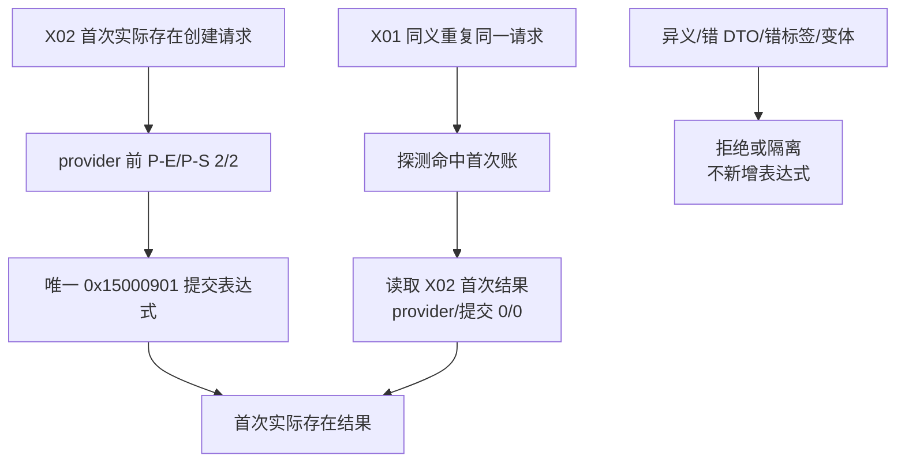

# L1-SIMPLIFY-P15 X01/X02 共享物理点与计数流程图 v0.23

更新时间：2026-08-06
依据：P15 v0.23 详细设计；正式基线 `b582d688c8bcc50db88ae8ab87c0e1f5f0d7cace`。

## 三层物理事实与场景计数

## X01/X02 同一物理点

正式 HEAD 的组合文件两处提交表达式只是基线事实，R01 表达式已存在但未带 `0x15012001U`；v0.23 只收口现有 WIP 到组合唯一点并为 R01 补该标签。X01 不产生第二个提交点；不得为了达到 50 个直接表达式新增或恢复代码。24 项代码加两条记录仍为完整 26 文件范围。
