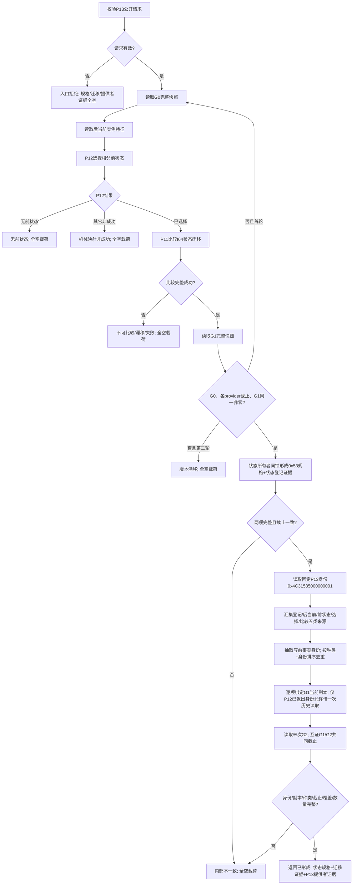

# L1-SIMPLIFY-P16-PRE1 形成后继状态规格提供者证据函数流程图 v0.1

## 1. 唯一根函数

```cpp
实际存在I64后继状态规格结果 形成实际存在I64后继状态规格(
    L1事实基座服务& L1,
    L1实例特征服务& 实例特征,
    L1状态服务& 状态,
    特征比较服务& 比较,
    const 实际存在I64后继状态规格请求& 请求);
```

## 2. 流程



## 3. 证据边界

- P16 的直接提供者见证固定一项：P13 身份、合同1、规则1、调用次数1。
- P13 内部 L1/实例特征/P12/P11/状态规格形成调用属于传递边界，不由 P16 猜测身份。
- 写前事实身份只来自最终成功轮次五类强类型材料；G0/G1首项、局部键、日志、默认L1身份均不能补造。
- 每个身份必须绑定同索引完整事实副本；优先G1当前事实，只有P12明确已退出的前状态身份允许历史回退，禁止重建事实。
- 成功身份组/副本组非空且等长，数量字段等于排序去重后的实际长度；非成功提供者证据为空。
- 本函数零写、零P15/P16/P14、无跨provider锁；日志仅为同一生产程序的人读观察。
- 专项复用既有唯一L1状态自检顺序360，不新增顺序582或其它启动登记。
