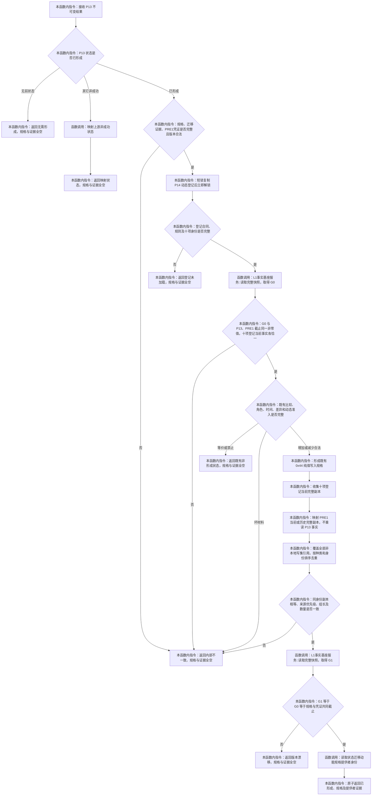

# 形成状态迁移动能规格提供者证据函数流程图 v0.1

计划身份：`L1-SIMPLIFY-P16-PRE2-DYNAMIC-SPEC-PROVIDER-EVIDENCE`

唯一根函数：`L1动态服务::形成状态迁移动能规格(const 实际存在I64后继状态规格结果&) const`

边界：本函数零 L1 写、零日志事实、零 P15/P16 调用；PRE1 当前只是待实现依赖。图不表示发布、应用确认、装配、崩溃恢复或跨进程恢复。
