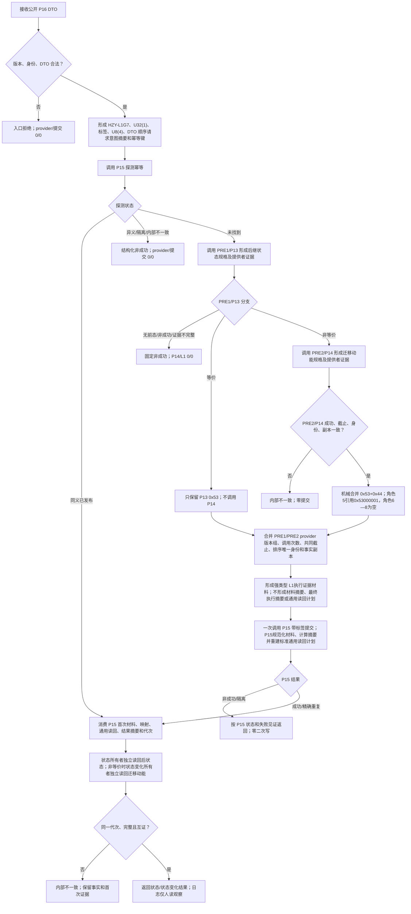

# L1-SIMPLIFY-P16 实际存在 I64 后继状态动态原子发布函数流程图 v0.3

对应详细设计：`20260806_L1-SIMPLIFY-P16-STATE-DYNAMIC-ATOMIC-PUBLISH_实际存在I64后继状态动态原子发布详细设计_v0.3.md`

P16 为 G7 变体4、生产标签 `0x15000603U`、幂等域 `0x10` 的独立入口；PRE1/PRE2 仅为待实现前置合同。

## 函数合同

```text
根函数：发布实际存在I64后继状态与迁移动能
归属模块 / 文件 / 层级：P16 状态与状态变化领域独立发布入口；待施工于 P16 白名单
现有或待新增：待新增
完整签名：
状态动态原子发布结果 发布实际存在I64后继状态与迁移动能(
    L1事实基座服务& L1,
    L1实例特征服务& 实例特征,
    L1状态服务& 状态,
    特征比较服务& 比较,
    L1动态服务& 动态,
    const 状态动态原子发布请求& 请求);
参数：五个领域服务引用为调用期间有效的非拥有引用；请求为只读公开 DTO，字段顺序与详细设计一致
返回结果：状态动态原子发布结果；成功/精确重复返回首次结果，入口拒绝、幂等冲突、许可拒绝、内部不一致和其它非成功按详细设计返回；不得二次提交
被调函数流程图：PRE1/PRE2 提供者合同、P15 标准提交与状态/状态变化独立读回按详细设计的合同映射；本图不伪造其未发布实现
```



P15 首次账、审计、恢复材料和结果摘要是 L1 权威；P16 不建立第二账、第二摘要器或第二读回计划。单一生产程序、日志非机器事实、崩溃/跨进程恢复、因果和 P82 不在本叶范围。
