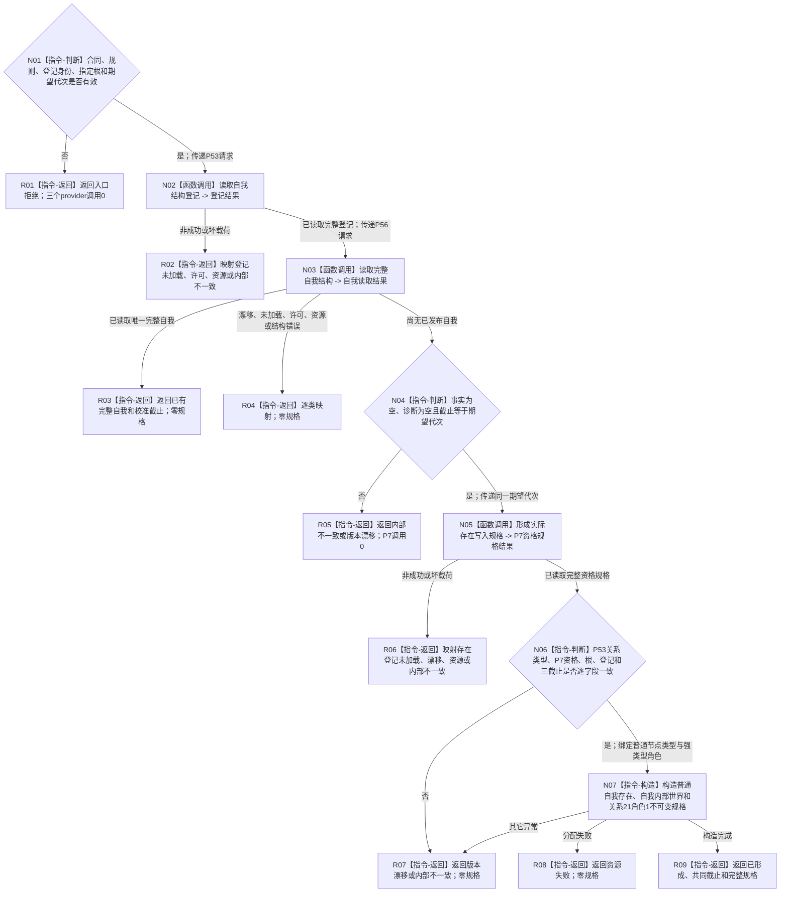

# L1-SIMPLIFY-P57 形成完整自我存在规格函数流程图 v0.1

更新时间：2026-08-06

## 依据

```text
规范/0050_项目通用机器逻辑与禁止性规则总纲_20260721.md
规范/4015_子规范_L1简化事实基座.md
规范/4190_子规范_语义分层世界结构与状态动态因果边界.md
规范/4200_子规范_世界树业务服务与同代次完整事实快照.md
规范/7130_子规范_自我内部世界成员特征与事实读取投影.md
规范/详细设计/20260804_SELF-GOV-CLOSURE_自我内部治理初始闭环实现方案_v0.2.md
规范/详细设计/20260806_L1-SIMPLIFY-P57-COMPLETE-SELF-EXISTENCE-SPEC_7130完整自我存在准入规格详细设计_v0.1.md
```

## 身份与边界

本图只表达存在领域零写根`L1完整自我存在服务::形成完整自我存在规格`。三场景规格、出生期成员、L1写集、事务参与者、原子发布者和完整自我初始化不在本图。

## 函数合同

```text
根函数：L1完整自我存在服务::形成完整自我存在规格
归属模块 / 文件 / 层级：海中鱼巣.领域.服务.L1完整自我存在 / 海中鱼巣/领域/服务.L1完整自我存在.ixx / L2存在领域规格
现有或待新增：待新增
完整签名：完整自我存在规格结果 形成完整自我存在规格(const 完整自我存在规格请求& 请求) const;
参数：请求；const借用，仅调用期间有效；版本、登记身份、指定普通世界根和期望事实代次必须有效
返回结果：调用方拥有的不可变值式结果；仅已形成携带规格；已有完整自我可回显校准截止但规格为空
被调函数流程图：P53读取自我结构登记、P56读取完整自我结构和P7形成实际存在写入规格引用各自现行单函数流程图
```

## 流程图



## 节点合同

| 节点 | 类型 | 参数 / 输入绑定 | 结果 / 输出绑定 | 事实读写 | 后继条件 | 验证 |
| --- | --- | --- | --- | --- | --- | --- |
| N01 | 本函数内指令 | 公开请求 | 入口裁决 | 零事实写 | 合法/非法 | 非法时provider调用0 |
| N02 | 函数调用 | 版本/身份 -> P53请求 | 登记结果 -> 关系类型 | 只读登记投影 | 完整/非成功 | 恰一次，不持锁跨调用 |
| N03 | 函数调用 | 登记/根/规则 -> P56请求 | 当前自我基数与截止 | 只读完整自我 | 尚无/已有/非成功 | 只接受P56正式状态 |
| N04 | 本函数内指令 | P56尚无结果、期望代次 | 同截止准入 | 零事实写 | 一致/矛盾 | 零事实、零诊断、非零同截止 |
| N05 | 函数调用 | 同一期望代次 -> P7请求 | 实际存在资格规格 | 只读P7登记与L1 | 完整/非成功 | 恰一次，不复制资格语义 |
| N06 | 本函数内指令 | P53/P56/P7值式副本 | 互证结果 | 零事实写 | 一致/漂移/损坏 | 登记、根、关系类型、资格和截止 |
| N07 | 本函数内指令 | 已验证字段 | 不可变存在规格 | 零事实写 | 成功/异常 | 固定普通自我存在、内部世界角色及角色1 |
| R01—R09 | 本函数内指令 | 分支状态与材料 | 结构化规格结果 | 零事实写 | 返回 | 仅已形成携带规格 |

## 关键边界

```text
单根函数；P53→P56→P7固定调用；provider间不持锁、不重取、不重试。
P56只有“角色1和角色2均为零”的尚无状态可准入；已有或损坏结构不得覆盖。
强类型本地角色不是写集本地键或稳定编码；本函数零分配身份、零L1写、零事务。
P7/P53/P56保持各自解释权；三场景、角色2成员和发布读回留给后继独立叶。
```
