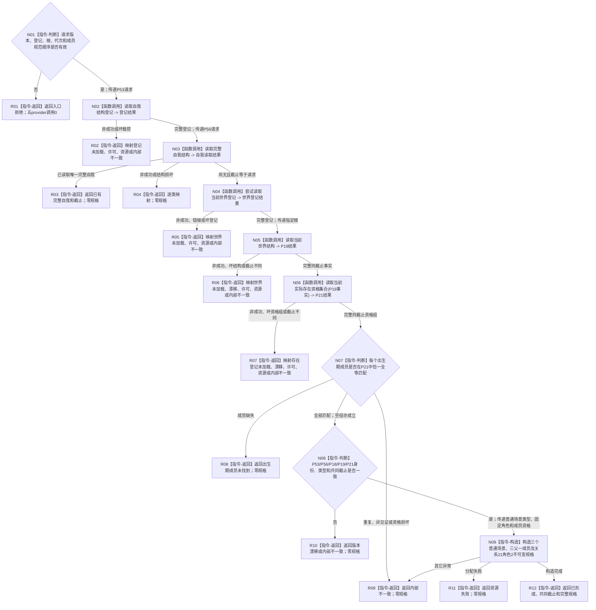

# L1-SIMPLIFY-P58 形成完整自我场景规格函数流程图 v0.1

更新时间：2026-08-06

## 依据

```text
规范/0050_项目通用机器逻辑与禁止性规则总纲_20260721.md
规范/4015_子规范_L1简化事实基座.md
规范/4190_子规范_语义分层世界结构与状态动态因果边界.md
规范/4200_子规范_世界树业务服务与同代次完整事实快照.md
规范/7130_子规范_自我内部世界成员特征与事实读取投影.md
规范/详细设计/20260804_SELF-GOV-CLOSURE_自我内部治理初始闭环实现方案_v0.2.md
规范/详细设计/20260806_L1-SIMPLIFY-P58-COMPLETE-SELF-SCENE-SPEC_7130完整自我场景与出生期成员准入规格详细设计_v0.1.md
```

## 身份与边界

本图只表达场景域零写根`L1完整自我场景服务::形成完整自我场景规格`。P57存在规格、跨域总规格、L1事务参与者、原子发布者和初始化入口不在本图。

## 函数合同

```text
根函数：L1完整自我场景服务::形成完整自我场景规格
归属模块 / 文件 / 层级：海中鱼巣.领域.服务.L1完整自我场景 / 海中鱼巣/领域/服务.L1完整自我场景.ixx / L2场景领域规格
现有或待新增：待新增
完整签名：完整自我场景规格结果 形成完整自我场景规格(const 完整自我场景规格请求& 请求) const;
参数：请求；const借用，仅调用期间有效；版本、登记身份、指定根、期望代次和严格升序无重复出生期成员组必须有效
返回结果：调用方拥有的不可变值式结果；仅已形成携带规格；已有完整自我或漂移可回显校准截止但规格为空
被调函数流程图：P53读取登记、P56读取完整自我、P18读取世界登记、P19读取当前世界结构、P21读取实际存在资格集合引用各自现行单函数流程图
```

## 流程图



## 节点合同

| 节点 | 类型 | 参数 / 输入绑定 | 结果 / 输出绑定 | 事实读写 | 后继条件 | 验证 |
| --- | --- | --- | --- | --- | --- | --- |
| N01 | 本函数内指令 | 公开请求 | 入口裁决 | 零事实写 | 合法/非法 | 非法时provider调用0 |
| N02 | 函数调用 | 版本/身份 -> P53 | 自我关系类型登记 | 只读登记投影 | 完整/非成功 | 恰一次、不跨调用持锁 |
| N03 | 函数调用 | 登记/根 -> P56 | 自我基数与截止 | 只读完整自我 | 尚无/已有/损坏 | 只接受角色1/2均零 |
| N04 | 函数调用 | 世界版本 -> P18 | 场景标记及父/成员类型 | 只读世界登记 | 完整/非成功 | 登记代次不作当前截止 |
| N05 | 函数调用 | 指定根 -> P19 | 当前场景结构 | 只读场景事实 | 完整/非成功 | 根、诊断、截止互证 |
| N06 | 函数调用 | P19事实 -> P21 | 实际存在资格组 | 只读存在资格 | 完整/非成功 | 输入原样、共同截止 |
| N07—N08 | 本函数内指令 | 请求成员、五provider副本 | 成员匹配与共同互证 | 零事实写 | 完整/缺失/矛盾 | 严格顺序、恰一匹配 |
| N09 | 本函数内指令 | 已验证场景/关系/成员材料 | 不可变场景规格 | 零事实写 | 成功/异常 | 三场景、三父一成员、角色2 |
| R01—R12 | 本函数内指令 | 分支状态与材料 | 结构化规格结果 | 零事实写 | 返回 | 仅已形成携带规格 |

## 关键边界

```text
单根函数；P53→P56→P18→P19→P21固定调用，provider间不持锁、不重取。
空出生期成员合法；非空组必须严格升序且每项具有P21当前实际存在资格。
P57关系21角色1不进入本规格；本叶只拥有场景域三场景、固定拓扑和角色2。
零本地键、零稳定编码分配、零L1写、零事务、零跨域总规格。
```
