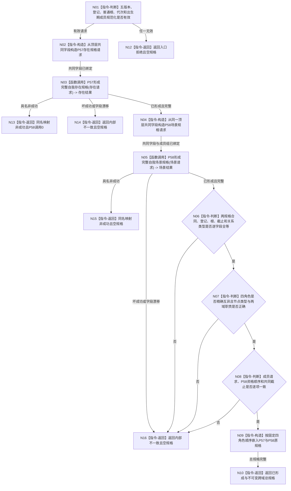

# P59 形成完整自我跨域总规格函数流程图 v0.1

更新时间：2026-08-06

## 依据

```text
规范/0050_项目通用机器逻辑与禁止性规则总纲_20260721.md
规范/4015_子规范_L1简化事实基座.md
规范/7130_子规范_自我内部世界成员特征与事实读取投影.md
规范/详细设计/20260804_SELF-GOV-CLOSURE_自我内部治理初始闭环实现方案_v0.2.md
规范/详细设计/20260806_L1-SIMPLIFY-P57-COMPLETE-SELF-EXISTENCE-SPEC_7130完整自我存在准入规格详细设计_v0.1.md
规范/详细设计/20260806_L1-SIMPLIFY-P58-COMPLETE-SELF-SCENE-SPEC_7130完整自我场景与出生期成员准入规格详细设计_v0.1.md
规范/详细设计/20260806_L1-SIMPLIFY-P59-COMPLETE-SELF-AGGREGATE-SPEC_7130完整自我跨域总规格详细设计_v0.1.md
```

## 身份与边界

正式目标单函数设计图。唯一根只组合P57与P58零写规格；不读取原始L1，不形成本地键、稳定编码、摘要、参与者或发布。

## 函数合同

```text
根函数：L1完整自我创建服务::形成完整自我跨域总规格
归属模块 / 文件 / 层级：海中鱼巣.领域.服务.L1完整自我创建 / 海中鱼巣/领域/服务.L1完整自我创建.ixx / 领域组合服务
现有或待新增：待新增
完整签名：完整自我跨域总规格结果 L1完整自我创建服务::形成完整自我跨域总规格(const 完整自我跨域总规格请求& 请求) const
参数：请求为同步只读借用；含五版本、登记身份、指定世界根、期望事实代次和严格升序无重复出生期成员组
返回结果：值式结果；仅已形成携带两域原规格与四角色规范顺序；其它为具名非成功且无部分规格
被调函数流程图：P57形成完整自我存在规格函数流程图；P58形成完整自我场景规格函数流程图
```

## 流程图



## 节点合同

| 节点 | 类型 | 参数 / 输入绑定 | 结果 / 输出绑定 | 事实读写 | 后继条件 | 验证 |
| --- | --- | --- | --- | --- | --- | --- |
| N01 | 指令-判断 | 顶层请求全部字段 | 有效或入口拒绝 | 零事实读取/写入 | 纯值准入完成 | 错版本、零根、乱序/重复成员均短路 |
| N02 | 指令-构造 | 顶层共同字段 | P57请求 | 零写 | 不允许调用方分叉嵌套请求 | 登记、根、截止逐字段相等 |
| N03 | 函数调用 | P57请求 -> P57形参 | 存在结果 -> 本地值 | P57合同内只读 | 已形成或具名非成功 | 恰调用一次；失败时P58为0 |
| N04 | 指令-构造 | 同一顶层共同字段与成员组 | P58请求 | 零写 | 仅P57完整后执行 | 与P57请求共用登记、根和截止 |
| N05 | 函数调用 | P58请求 -> P58形参 | 场景结果 -> 本地值 | P58合同内只读 | 已形成或具名非成功 | 恰调用一次 |
| N06 | 指令-判断 | 两域规格 | 共同合同判断 | 零写 | 全等才继续 | 合同、登记、根、截止、关系类型 |
| N07 | 指令-判断 | 两域角色和节点类型 | 角色/职责判断 | 零写 | 精确互异才继续 | 四角色固定，四新节点均普通 |
| N08 | 指令-判断 | 顶层成员、P58成员资格 | 顺序/截止判断 | 零写 | 逐项相等才继续 | 空、单项、多项矩阵 |
| N09 | 指令-构造 | 两域原规格、固定角色顺序 | 总规格 | 零写 | 完整才返回 | 无L1键、编码、摘要、事务 |
| N10/N12—N16 | 指令-返回 | 已形成或具名失败 | 合同允许的结果 | 零写 | 函数结束 | 非成功无部分规格 |

## 关键边界

```text
P59只拥有跨域互证，不拥有存在域、场景域或L1写入解释权。
四角色是业务引用，不是写集本地键；稳定编码只能由后继首次L1提交分配。
P15/P37调用为0；P15 v0.13只约束后继发布者，不进入本函数。
provider间不重取、不重试；不同截止材料不得拼接。
```
