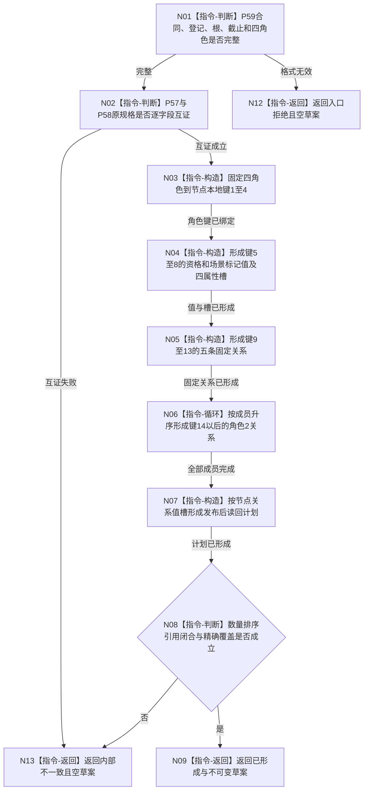

# P60 形成完整自我 L1 写集草案函数流程图 v0.1

更新时间：2026-08-06

## 依据

```text
规范/0050_项目通用机器逻辑与禁止性规则总纲_20260721.md
规范/4015_子规范_L1简化事实基座.md
规范/7130_子规范_自我内部世界成员特征与事实读取投影.md
规范/详细设计/20260804_SELF-GOV-CLOSURE_自我内部治理初始闭环实现方案_v0.2.md
规范/详细设计/20260806_L1-SIMPLIFY-P59-COMPLETE-SELF-AGGREGATE-SPEC_7130完整自我跨域总规格详细设计_v0.1.md
规范/详细设计/20260806_L1-SIMPLIFY-P60-COMPLETE-SELF-L1-WRITESET-SPEC_7130完整自我L1写集与读回草案详细设计_v0.1.md
```

## 身份与边界

正式目标单函数设计图。唯一根把P59总规格纯值映射为L1写集与读回草案；不调用provider，不形成幂等/摘要/操作标签，不取得事务或提交。

## 函数合同

```text
根函数：L1完整自我写集数据操作::形成完整自我L1写集草案
归属模块 / 文件 / 层级：海中鱼巣.领域.数据操作.L1完整自我写集 / 海中鱼巣/领域/数据操作.L1完整自我写集.ixx / 领域专用数据操作
现有或待新增：待新增
完整签名：完整自我L1写集草案结果 L1完整自我写集数据操作::形成完整自我L1写集草案(const 完整自我跨域总规格& 总规格) const
参数：总规格为同步只读借用；必须是P59完整、共同截止且两域逐字段互证的值式规格
返回结果：值式结果；仅已形成携带连续本地键、五类写集和精确通用读回计划
被调函数流程图：无；全部为本函数纯值指令
```

## 流程图



## 节点合同

| 节点 | 类型 | 参数 / 输入绑定 | 结果 / 输出绑定 | 事实读写 | 后继条件 | 验证 |
| --- | --- | --- | --- | --- | --- | --- |
| N01 | 指令-判断 | P59总规格 | 入口有效性 | 零事实读写 | 完整才继续 | 错版本、零登记/根/截止、坏角色拒绝 |
| N02 | 指令-判断 | 两域原规格 | 互证判断 | 零事实读写 | 全等才继续 | 合同、截止、资格、标记、关系逐字段 |
| N03 | 指令-构造 | 四业务角色 | 键1—4节点和角色映射 | 零写 | 固定顺序 | 不接受调用方传键 |
| N04 | 指令-构造 | 两域资格/标记材料 | 键5—8值和四槽 | 零写 | 来源与属性类型精确 | I64值均为1 |
| N05 | 指令-构造 | 根、四角色、三关系类型 | 键9—13固定关系 | 零写 | 三父一成员一角色1 | 端点、类型、顺序/角色精确 |
| N06 | 指令-循环 | 规范化成员资格组 | 键14以后角色2关系 | 零写 | 保持成员升序 | 空组合法；不新建成员 |
| N07 | 指令-构造 | 四类写项 | `17+N`读回项 | 零写 | 精确覆盖 | 节点/关系/值/槽规范化 |
| N08 | 指令-判断 | 完整草案 | 完整性结论 | 零写 | 全部成立才返回 | 连续键、引用闭合、数量和无退出 |
| N09/N12/N13 | 指令-返回 | 已形成或具名失败 | 合同允许结果 | 零写 | 函数结束 | 非成功无部分草案 |

## 关键边界

```text
P60只拥有L1写集与读回草案编排，不拥有P57/P58领域准入解释权。
本地键是单次写集内部引用；稳定编码只能由后继首次L1提交结果返回。
P15/P37/P54/provider/L1调用均为0；P15真实接口只作为激活门禁。
草案没有幂等键、双摘要、执行证据、操作标签、事务或发布结果。
```
