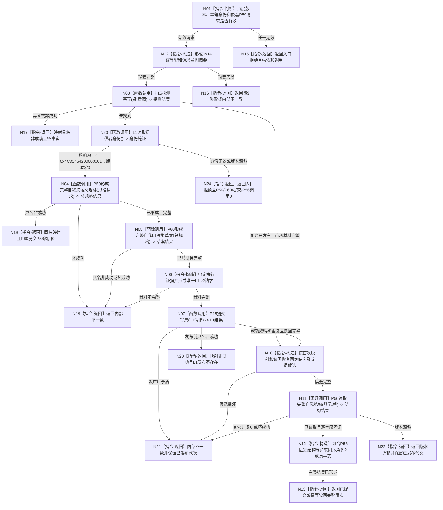

# P61 发布完整自我函数流程图 v0.1

更新时间：2026-08-06

## 依据

```text
规范/0050_项目通用机器逻辑与禁止性规则总纲_20260721.md
规范/4015_子规范_L1简化事实基座.md
规范/7130_子规范_自我内部世界成员特征与事实读取投影.md
规范/详细设计/20260804_SELF-GOV-CLOSURE_自我内部治理初始闭环实现方案_v0.2.md
规范/详细设计/20260806_L1-SIMPLIFY-P59-COMPLETE-SELF-AGGREGATE-SPEC_7130完整自我跨域总规格详细设计_v0.1.md
规范/详细设计/20260806_L1-SIMPLIFY-P60-COMPLETE-SELF-L1-WRITESET-SPEC_7130完整自我L1写集与读回草案详细设计_v0.1.md
规范/详细设计/20260806_L1-SIMPLIFY-P61-COMPLETE-SELF-PUBLISH_7130完整自我原子发布详细设计_v0.1.md
```

## 身份与边界

正式目标单函数设计图。唯一根消费P59/P60并经P15一次发布完整自我，再用P56验证固定结构；不建立初始化装配、实例槽、安全/服务根、根值或根需求。

## 函数合同

```text
根函数：L1完整自我发布服务::发布完整自我
归属模块 / 文件 / 层级：海中鱼巣.领域.发布.L1完整自我 / 海中鱼巣/领域/发布.L1完整自我.ixx / 领域原子发布服务
现有或待新增：待新增
完整签名：完整自我发布结果 L1完整自我发布服务::发布完整自我(const 完整自我发布请求& 请求) const
参数：请求为同步只读借用；含顶层版本、公开幂等身份和完整P59规格请求
返回结果：值式结果；仅已提交/幂等读回携带P56完整结构和请求同序出生期成员发布事实
被调函数流程图：P59形成完整自我跨域总规格；P60形成完整自我L1写集草案；P56读取完整自我结构；P15正式探测/提交图以其替代结果为准
```

## 流程图



## 节点合同

| 节点 | 类型 | 参数 / 输入绑定 | 结果 / 输出绑定 | 事实读写 | 后继条件 | 验证 |
| --- | --- | --- | --- | --- | --- | --- |
| N01 | 指令-判断 | 公开请求 | 入口有效性 | 零事实读写 | 有效才继续 | 错版本/身份/成员短路 |
| N02 | 指令-构造 | 公开请求全部字段 | 幂等键、意图摘要 | 零写 | 非零完整 | 0x14与0x50336101唯一 |
| N03 | 函数调用 | 键/意图 -> P15 | 探测结果 -> 本地值 | P15只读 | 未找到或同义 | provider前恰一次 |
| N23 | 函数调用 | 注入的L1服务 | `(0x4C31464200000001,2,0)`身份凭证 | 无锁且零事实读取 | 身份精确才继续 | 仅未找到后恰一次；不计事实provider调用 |
| N04 | 函数调用 | 嵌套请求 -> P59 | 总规格结果 | P59合同内只读 | 仅完整继续 | 恰一次；P57/P58不直调 |
| N05 | 函数调用 | 总规格 -> P60 | 写集草案 | 纯值零写 | 仅完整继续 | 数量与连续键精确 |
| N06 | 指令-构造 | 意图、总规格、草案 | P15正式L1请求 | 零写 | 证据完整 | 不复制P15载体 |
| N07 | 函数调用 | L1请求 -> P15 | 首次/重复结果 | 一次L1事务 | 成功材料完整 | 提交最多一次 |
| N10 | 指令-构造 | 首次映射、同锁读回、请求 | 固定结构/成员候选 | 零写 | `13+N/17+N`完整 | 不普通重读L1 |
| N11 | 函数调用 | 登记身份、根 -> P56 | 当前完整结构 | P56只读 | 完整且匹配 | 成功/同义路径恰一次 |
| N12 | 指令-构造 | P56结构、P15角色2读回 | 完整自我发布事实 | 零写 | 字段全等 | 不夹带其它成员 |
| N13/N15—N22/N24 | 指令-返回 | 成功或具名失败 | 合同允许结果 | 零额外写 | 函数结束 | 发布后失败保留代次 |

## 关键边界

```text
P61直接发布L1事实但不建立P53第二投影，P37/P54调用为0。
稳定编码只来自P15首次映射；调用方、P59和P60均不能预分配。
P15 v0.14已冻结并激活L1身份与调用/去重分账计划，但代码结果尚未进入main并经接受；本图只消费冻结合同，真实接口仍是P61激活门禁。
P56只验证五身份五固定关系；出生期成员只从P15首次同锁读回按请求顺序形成。
```
