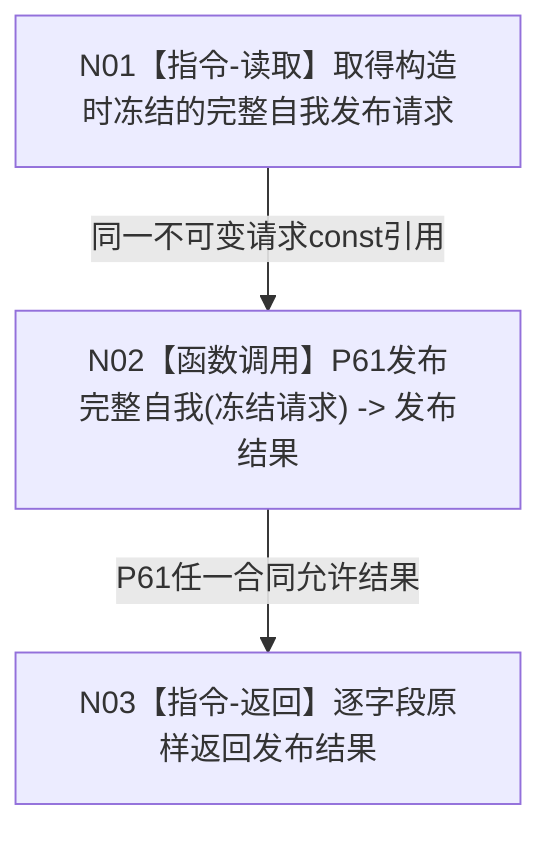

# P62 初始化完整自我函数流程图 v0.1

更新时间：2026-08-06

## 依据

```text
规范/0050_项目通用机器逻辑与禁止性规则总纲_20260721.md
规范/4015_子规范_L1简化事实基座.md
规范/7130_子规范_自我内部世界成员特征与事实读取投影.md
规范/详细设计/20260804_SELF-GOV-CLOSURE_自我内部治理初始闭环实现方案_v0.2.md
规范/详细设计/20260806_L1-SIMPLIFY-P61-COMPLETE-SELF-PUBLISH_7130完整自我原子发布详细设计_v0.1.md
规范/详细设计/20260806_L1-SIMPLIFY-P62-COMPLETE-SELF-INITIALIZE_7130完整自我初始化入口详细设计_v0.1.md
```

## 身份与边界

正式目标单函数设计图。唯一根使用构造时冻结的P61请求，调用P61恰一次并逐字段原样返回；不建立第二发布语义、实例槽、根定义、生产装配或旧初始化迁移。

## 函数合同

```text
根函数：L1完整自我初始化服务::初始化完整自我
归属模块 / 文件 / 层级：海中鱼巣.领域.初始化.L1完整自我 / 海中鱼巣/领域/初始化.L1完整自我.ixx / 领域初始化适配入口
现有或待新增：待新增
完整签名：完整自我发布结果 L1完整自我初始化服务::初始化完整自我() const
参数：无；构造时已深复制一份版本化完整自我发布请求
返回结果：P61完整自我发布结果逐字段原样返回；所有成功与非成功状态均不重映射
被调函数流程图：流程图/20260806_L1-SIMPLIFY-P61-COMPLETE-SELF-PUBLISH_发布完整自我函数流程图_v0.1.md
```

## 流程图



## 节点合同

| 节点 | 类型 | 参数 / 输入绑定 | 结果 / 输出绑定 | 事实读写 | 后继条件 | 验证 |
| --- | --- | --- | --- | --- | --- | --- |
| N01 | 指令-读取 | 私有const发布请求 | 同一请求const引用 | 零事实读写 | 始终继续 | 构造后来源变量变化不影响 |
| N02 | 函数调用 | 冻结请求 -> P61请求 | P61结果 -> 本地结果 | 仅P61合同内可能发布 | 调用完成 | 每次入口恰一次 |
| N03 | 指令-返回 | 本地P61结果 | 完整自我发布结果 | 零额外写 | 函数结束 | 全状态全字段原样 |

## 关键边界

```text
函数无参数，不允许每次调用提交裸键或重组P61请求。
P62无新幂等域、操作标签、摘要、账、事务、稳定编码、读回和状态映射。
重复或并发初始化仍调用P61，由P61裁决首次、同义、异义和漂移；P62不加锁、不缓存、不重试。
旧初始化、实例槽、安全/服务根、根值、根需求和生产接线均不进入本图。
```
