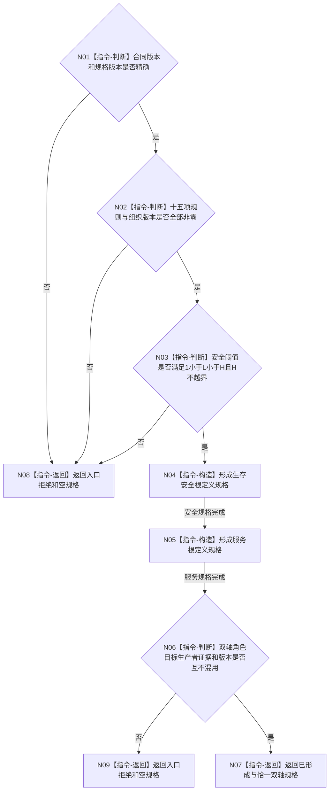

# P63 形成自我双轴根定义规格函数流程图 v0.1

更新时间：2026-08-06

## 依据

```text
规范/0050_项目通用机器逻辑与禁止性规则总纲_20260721.md
规范/6120_子规范_自我存在服务与生存基本因果闭环_20260720.md
规范/6130_子规范_自我根特征抽象定义与自检缺口_20260720.md
规范/6160_子规范_服务需求合同预算与准备结算.md
规范/6170_子规范_服务值时间维护生存安全回归与任务门控.md
规范/详细设计/20260804_SELF-GOV-CLOSURE_自我内部治理初始闭环实现方案_v0.2.md
规范/详细设计/20260806_L1-SIMPLIFY-P63-SELF-ROOT-DEFINITION-SPEC_6130安全服务双轴根定义规格详细设计_v0.1.md
```

## 身份与边界

正式目标单函数设计图。唯一根纯值形成生存安全/服务双轴根定义规格；不调用provider，不发布定义，不建立实例槽、根值或根需求。

## 函数合同

```text
根函数：L1自我根定义规格服务::形成自我双轴根定义规格
归属模块 / 文件 / 层级：海中鱼巣.领域.服务.L1自我根定义规格 / 海中鱼巣/领域/服务.L1自我根定义规格.ixx / 抽象特征领域
现有或待新增：待新增
完整签名：自我双轴根定义规格结果 L1自我根定义规格服务::形成自我双轴根定义规格(const 自我双轴根定义规格请求& 请求) const noexcept
参数：请求为同步只读借用；含合同/规格版本、安全L/H及十五项非零规则/组织版本
返回结果：值式结果；仅已形成携带恰一安全规格和恰一服务规格
被调函数流程图：无；全部为本函数纯值指令
```

## 流程图



## 节点合同

| 节点 | 类型 | 参数 / 输入绑定 | 结果 / 输出绑定 | 事实读写 | 后继条件 | 验证 |
| --- | --- | --- | --- | --- | --- | --- |
| N01 | 指令-判断 | 合同/规格版本 | 版本结论 | 零事实读写 | 精确才继续 | 错任一版本短路 |
| N02 | 指令-判断 | 十五项版本 | 完整性结论 | 零事实读写 | 全非零才继续 | 不补默认版本 |
| N03 | 指令-判断 | 安全L/H | 阈值结论 | 零事实读写 | `1＜L＜H≤I64_MAX` | 边界与顺序 |
| N04 | 指令-构造 | L/H和安全版本 | 安全规格 | 零事实读写 | 固定值域/目标/生产边 | `0..MAX`、`>1` |
| N05 | 指令-构造 | 服务版本 | 服务规格 | 零事实读写 | 固定值域/目标/生产边 | `0..MAX`、`==MAX`、30天 |
| N06 | 指令-判断 | 两个完整规格 | 双轴互证 | 零事实读写 | 精确成立才成功 | 角色、目标、生产者、证据不混用 |
| N07/N08/N09 | 指令-返回 | 已形成或拒绝 | 合同允许结果 | 零事实读写 | 函数结束 | 非成功无部分规格 |

## 关键边界

```text
P63拥有双轴根定义零写规格，不拥有根定义L1形状、事务、发布或稳定编码。
P2只提供通用I64定义能力，不能用两次调用或名称补齐P63专用语义。
安全根与6140分层安全值不同；服务对象、固定因素表和任务均不进入定义。
实例槽、当前值和根需求必须等待根定义正式发布后逐叶建立。
```
