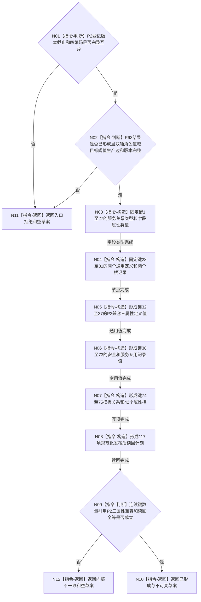

# P64 形成双轴根定义 L1 草案函数流程图 v0.1

更新时间：2026-08-06

## 依据

```text
规范/0050_项目通用机器逻辑与禁止性规则总纲_20260721.md
规范/4015_子规范_L1简化事实基座.md
规范/4020_子规范_领域类型化数据记录与组合读取投影边界.md
规范/6130_子规范_自我根特征抽象定义与自检缺口_20260720.md
规范/详细设计/20260806_L1-SIMPLIFY-P63-SELF-ROOT-DEFINITION-SPEC_6130安全服务双轴根定义规格详细设计_v0.1.md
规范/详细设计/20260806_L1-SIMPLIFY-P64-SELF-ROOT-DEFINITION-L1-WRITESET-SPEC_6130双轴根定义L1写集与读回草案详细设计_v0.1.md
```

## 身份与边界

正式目标单函数设计图。唯一根把P2登记与P63双轴规格纯值映射为L1写集/读回草案；不调用provider，不形成幂等、意图编码、摘要、事务或发布。

## 函数合同

```text
根函数：L1自我根定义写集数据操作::形成双轴根定义L1草案
归属模块 / 文件 / 层级：海中鱼巣.领域.数据操作.L1自我根定义写集 / 海中鱼巣/领域/数据操作.L1自我根定义写集.ixx / 抽象特征领域专用数据操作
现有或待新增：待新增
完整签名：自我双轴根定义L1草案结果 L1自我根定义写集数据操作::形成双轴根定义L1草案(const 特征定义登记& 通用定义登记, const 自我双轴根定义规格结果& 双轴结果) const
参数：两个参数均为同步只读借用；登记必须是P2完整值式副本，结果必须是P63已形成且恰一携带安全/服务规格的纯值结果
返回结果：值式结果；仅已形成携带31节点、42值、2关系、42槽和117项读回草案
被调函数流程图：无；全部为本函数纯值指令
```

## 流程图



## 节点合同

| 节点 | 类型 | 参数 / 输入绑定 | 结果 / 输出绑定 | 事实读写 | 后继条件 | 验证 |
| --- | --- | --- | --- | --- | --- | --- |
| N01 | 指令-判断 | P2登记 | 完整登记结论 | 零事实读写 | 完整互异才继续 | 版本、截止、服务/三类型 |
| N02 | 指令-判断 | P63双轴结果 | 双轴完整结论 | 零事实读写 | 已形成且恰一安全/服务才继续 | 值域、目标、L/H、生产边、十五版本 |
| N03 | 指令-构造 | 固定字段枚举 | 键1—27节点 | 零事实读写 | 顺序固定 | 服务、模板关系类型、25个I64属性类型 |
| N04 | 指令-构造 | 双轴角色 | 键28—31节点 | 零事实读写 | 四普通节点 | 两定义与两记录分离 |
| N05 | 指令-构造 | P2登记和值域 | 键32—37值 | 零事实读写 | 每定义恰三属性 | 标记/下界/上界及P2来源 |
| N06 | 指令-构造 | P63全部字段 | 键38—73值 | 零事实读写 | 安全15、服务21 | 来源键1、掩码5/6 |
| N07 | 指令-构造 | 两记录/定义/模板类型 | 键74—75关系及42槽 | 零事实读写 | 端点和槽一一对应 | 关系22为0、退出为0 |
| N08 | 指令-构造 | 全部写项 | 117项读回计划 | 零事实读写 | 精确覆盖 | 31+2+42+42 |
| N09 | 指令-判断 | 完整草案 | 闭合结论 | 零事实读写 | 全部成立才成功 | 键1—75、引用、数量、全等 |
| N10/N11/N12 | 指令-返回 | 已形成或具名失败 | 合同允许结果 | 零事实读写 | 函数结束 | 非成功无部分草案 |

## 关键边界

```text
通用定义节点各恰三个P2属性；P63专用字段只进入独立根记录。
根记录模板关系不是关系22；实例槽只能在根定义发布后由特征领域另建。
P64不生成P15领域意图字节、G组、标签、摘要、执行证据或事务。
本地键只在单次草案内有效，稳定编码只能由后继首次L1提交分配。
```
