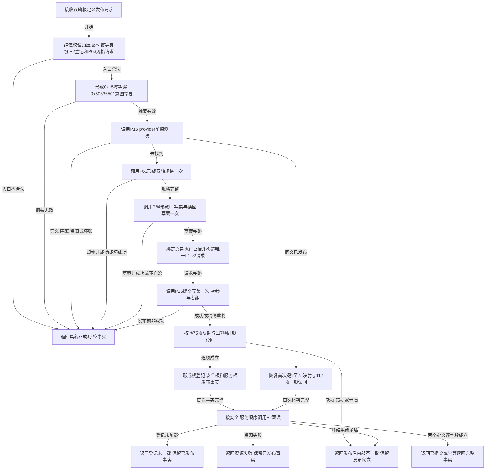

# L1-SIMPLIFY-P65 发布自我双轴根定义函数流程图 v0.1

创建侧正式基线：`e1d8181128762ff4e7fdd43d0bee227fa4ee2f40`

目标函数：`L1自我根定义发布服务::发布自我双轴根定义`

固定边界：首次路径只有一次P15提交；同义路径P63/P64/提交均为0；P2只在发布已确认后各读取安全/服务定义一次。全流程不建立第二登记投影，不调用P37/P54，不写关系22、根值或根需求。
