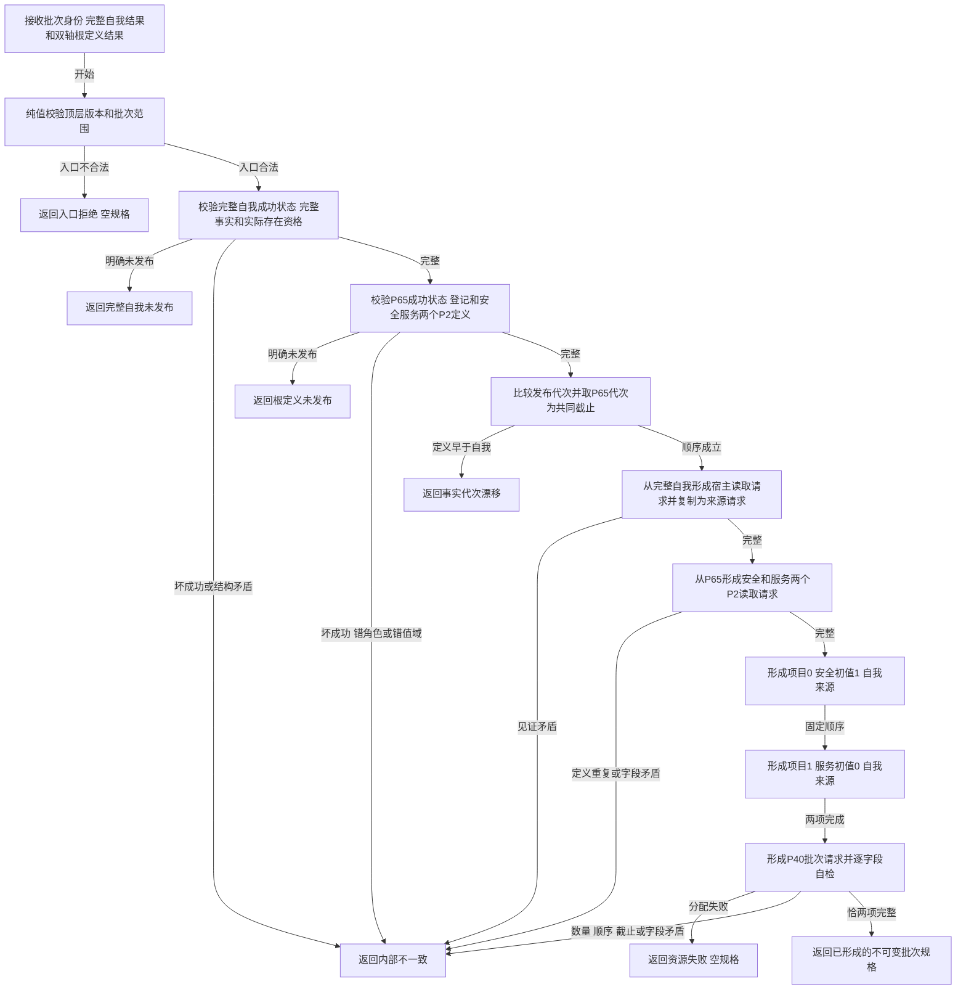

# L1-SIMPLIFY-P66 形成自我双轴根实例批次规格函数流程图 v0.1

创建侧正式基线：`bcb7d32ec0ca2b8d322589b114600a76161855f8`

目标函数：`L1自我根实例规格服务::形成自我双轴根实例批次规格`

固定边界：全流程只组合值式事实，P2/P7/P15/P36/P40/L1调用均为0；不接受自由初始值或外部来源，不发布关系22、实例槽、当前值或根需求。
