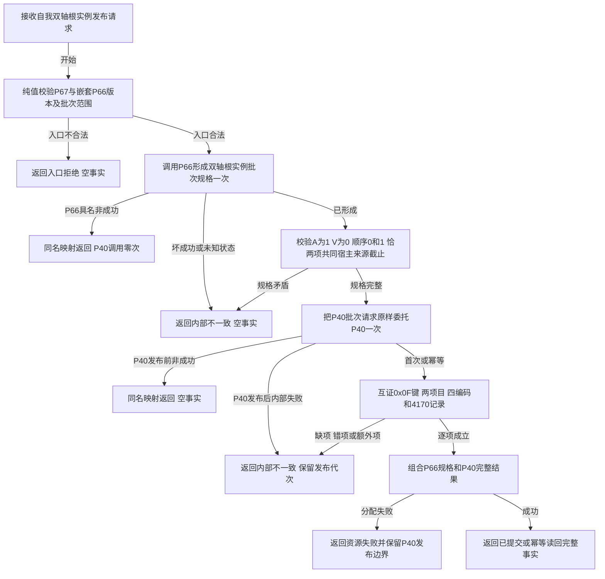

# L1-SIMPLIFY-P67 发布自我双轴根实例函数流程图 v0.1

创建侧正式基线：`af95c3608aca0130967c1540705fe66df71708f8`

目标函数：`L1自我根实例发布服务::发布自我双轴根实例`

固定边界：P66恰一次，P40至多一次且仅P66成功时调用；P15/P36/P37/P38/P39/L1直接调用0。全流程不新增幂等身份、摘要、稳定编码、4170账、事务、独立读回、根需求或生产装配。
