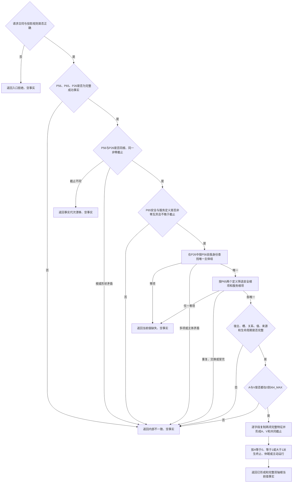

# L1-SIMPLIFY-P68-SELF-ROOT-CURRENT-VALUE-PROJECTION
# 组合同代次自我双轴根当前值函数流程图 v0.1

```mermaid
flowchart TD
    N01{"请求合同与投影规则是否正确"} -->|否| N12["返回入口拒绝、空事实"]
    N01 -->|是| N02{"P56、P65、P26是否为完整成功事实"}
    N02 -->|否| N13["返回内部不一致、空事实"]
    N02 -->|是| N03{"P56与P26是否同根、同一非零截止"}
    N03 -->|截止不同| N14["返回事实代次漂移、空事实"]
    N03 -->|根或形状矛盾| N13
    N03 -->|是| N04{"P65安全与服务定义是否非零互异且不晚于截止"}
    N04 -->|否| N13
    N04 -->|是| N05["在P26中按P56自我身份查找唯一主体组"]
    N05 -->|零项| N15["返回当前值缺失、空事实"]
    N05 -->|多项或主体矛盾| N13
    N05 -->|唯一| N06["按P65两个定义筛选安全根项和服务根项"]
    N06 -->|任一零项| N15
    N06 -->|重复、交换或冒充| N13
    N06 -->|各唯一| N07{"宿主、槽、关系、值、来源和生命周期是否完整"}
    N07 -->|否| N13
    N07 -->|是| N08{"A与V是否都在0到I64_MAX"}
    N08 -->|否| N13
    N08 -->|是| N09["逐字段复制两项完整特征并形成A、V和共同截止"]
    N09 --> N10["按A等于0、等于1或大于1派生终止、休眠或主动运行"]
    N10 --> N11["返回已形成和完整双轴根当前值事实"]
```

最大边界：纯值函数只消费 P56、P65、P26 成功事实；provider 调用、许可、重试、P67/P40
出生值、根需求、维护、事务、装配、恢复和正式验收全部为零。
