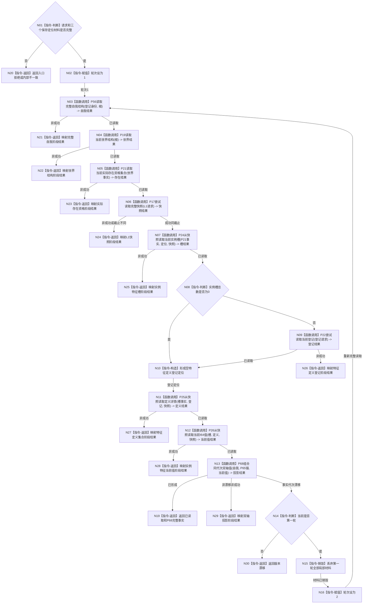

# L1-SIMPLIFY-P69-SELF-ROOT-CURRENT-VALUE-READ
# 读取当前双轴根值函数流程图 v0.1

更新时间：2026-08-06

## 依据

```text
0050、4015、4190、4200、6100、6120、6130、6170、7130
P17—P26、P29、P56、P65、P68 v0.1 正式详细设计
```

## 身份与边界

正式单函数设计图。只冻结生产读取协调、状态短路和一次完整组合漂移重读；不写机器事实。

## 函数合同

```text
根函数：L1自我根当前值读取服务::读取当前双轴根值
归属模块 / 文件 / 层级：海中鱼巣.领域.服务.L1自我根当前值读取 / 同名ixx / L2
现有或待新增：待新增
完整签名：自我双轴根当前值读取结果 读取当前双轴根值(
    const 自我双轴根当前值读取请求& 请求) const
参数：请求为只读借用；含合同、协调规则、世界规则和指定世界根
返回结果：调用方拥有的值；成功含P68双轴事实，非成功含状态与最早失败阶段
被调函数流程图：复用P56、P19、P21、P17、P24—P26、P68冻结合同；不新增其内部图
```

## 流程图



## 节点合同

| 节点 | 类型 | 参数 / 输入绑定 | 结果 / 输出绑定 | 事实读写 | 后继条件 | 验证 |
| --- | --- | --- | --- | --- | --- | --- |
| N03—N06 | 函数调用 | 根、登记身份、上一成功事实 | 自我、世界、存在、L1快照 | 只读 | 成功才继续 | 固定顺序、同截止、短路 |
| N07—N12 | 函数调用 | 同一P17快照及前序事实 | 槽、登记、定义、当前值 | 只读 | 成功才继续 | 空槽跳P22，其余各恰一次 |
| N13 | 函数调用 | P56事实、P65锚、P26事实 | P68投影结果 | 无写入 | 成功、漂移或具名失败 | 不重算P68事实 |
| N14—N16 | 指令 | 第一轮组合漂移 | 第二轮完整重读 | 无写入 | 最多一次 | 零跨轮材料复用 |
| N19—N30 | 返回 | 具名状态和阶段 | 不可变读取结果 | 无写入 | 函数结束 | 非成功零事实 |

## 关键边界

```text
不伪造P21单主体范围；P24—P26只消费同一P17快照。
P22只在非空槽分支调用；P65只作定位锚，不调用P65发布者。
只有P68组合漂移触发一次完整重读；provider非成功立即短路。
不调用P29状态动态链，不形成根需求、6170维护、装配、恢复或正式验收。
```
