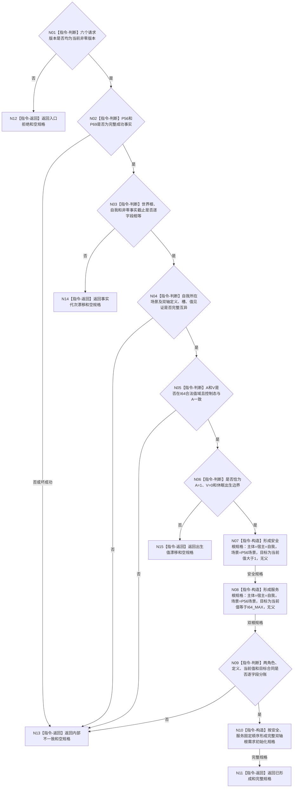

# P70 形成自我双轴根需求初始化规格函数流程图 v0.1

更新时间：2026-08-06

## 依据

```text
0050、5090—5130、6100、6120、6130、6170、7130
SELF-GOV-CLOSURE v0.2
P56、P63、P66—P70详细设计
```

## 身份与边界

正式目标单函数流程图。只冻结 P70 纯值规格形成过程；代码尚未实现。本图不发布目标状态、
需求、生命周期或父关系，不代表 6170 维护、根差距、任务或生产装配已经完成。

## 函数合同

```text
根函数：形成自我双轴根需求初始化规格
归属模块 / 文件 / 层级：海中鱼巣.领域.服务.L1自我根需求规格 /
  海中鱼巣/领域/服务.L1自我根需求规格.ixx / L4需求领域
现有或待新增：待新增纯值函数
完整签名：自我双轴根需求初始化规格结果 形成自我双轴根需求初始化规格(
  const 自我双轴根需求初始化规格请求& 请求,
  const 完整自我结构事实& 当前自我,
  const 自我双轴根当前值事实& 当前根值) noexcept
参数：请求、当前自我和当前根值均为只读借用，仅在同步调用期间有效；不保存引用
返回结果：已形成、入口拒绝、事实代次漂移、出生值漂移或内部不一致；仅已形成携带完整双根规格
被调函数流程图：无；provider和其它非平凡函数调用均为0
```

## 流程图



## 节点合同

| 节点 | 类型 | 参数 / 输入绑定 | 结果 / 输出绑定 | 事实读写 | 后继条件 | 验证 |
| --- | --- | --- | --- | --- | --- | --- |
| N01 | 本函数内指令-判断 | 请求六版本 | 版本门禁 | 零读写 | 是/否 | 任一错误先拒绝 |
| N02 | 本函数内指令-判断 | P56/P69事实 | 完整成功门禁 | 只读值式输入 | 是/坏成功 | 空事实不继续 |
| N03 | 本函数内指令-判断 | 两根、两自我、两截止 | 同根同自我同截止 | 只读值式输入 | 相等/不等 | 截止必须非零 |
| N04 | 本函数内指令-判断 | P56场景、P69双轴见证 | 身份完整性 | 只读值式输入 | 完整/矛盾 | 不按名称补造 |
| N05 | 本函数内指令-判断 | A、V、控制态 | 值域与控制态互证 | 只读值式输入 | 一致/矛盾 | A的0/1/>1映射 |
| N06 | 本函数内指令-判断 | A、V、控制态 | 出生边界 | 只读值式输入 | 出生/已漂移 | 只接受1/0/休眠 |
| N07 | 本函数内指令-构造 | 自我、场景、安全根值 | 安全根规格 | 零写入 | 已形成 | 目标严格大于1 |
| N08 | 本函数内指令-构造 | 自我、场景、服务根值 | 服务根规格 | 零写入 | 已形成 | 目标等于I64_MAX |
| N09 | 本函数内指令-判断 | 两规格 | 分账互证 | 零写入 | 一致/矛盾 | 角色与目标不交换 |
| N10 | 本函数内指令-构造 | 两个完整规格 | 双轴规格 | 零写入 | 固定顺序 | 安全先于服务 |
| N11—N15 | 本函数内指令-返回 | 完整规格或空规格 | 唯一结构化结果 | 零写入 | 返回 | 非成功零部分规格 |

## 关键边界

```text
P70只形成需求领域纯值规格，不分配稳定编码、本地键、关系类型、幂等身份或事务。
P9/P16实际关系19状态不成为目标状态合同；P69当前值不成为需求满足或结算事实。
出生值漂移不授权补造第二组根需求；后继发布者必须先按正式幂等身份读取既有结果。
P56/P63/P69仍是待实现上游，计划激活必须等待真实接口逐字段匹配。
```
