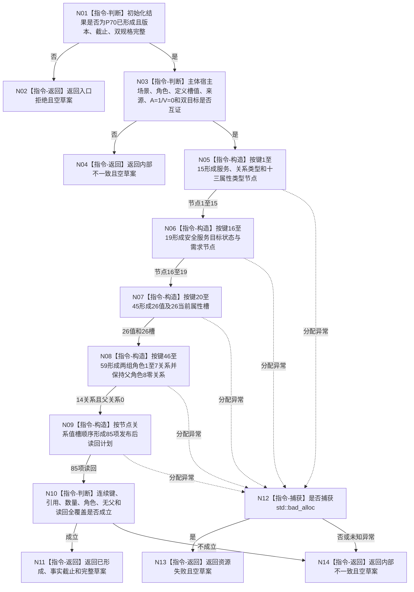

# P71 形成双轴根需求 L1 草案函数流程图 v0.1

更新时间：2026-08-06

## 依据

```text
3100、4015、4030、4040、4050、5090—5110、6130、6170、7130
SELF-GOV-CLOSURE v0.2
P15 v0.22、P37、P53—P70正式设计合同
规范/详细设计/20260806_L1-SIMPLIFY-P71-SELF-ROOT-DEMAND-L1-WRITESET-SPEC_6130双轴根需求L1写集与读回草案详细设计_v0.1.md
```

## 身份与边界

本图是 P71 目标单函数正式施工图，只对应一个待新增纯值根。它形成 L1 写集与读回草案，
不调用 provider，不分配稳定编码，不提交事实，不建立需求读取、6170维护或生产装配。

## 函数合同

```text
根函数：形成双轴根需求L1草案
归属模块 / 文件 / 层级：海中鱼巣.领域.数据操作.L1自我根需求写集 / 海中鱼巣/领域/数据操作.L1自我根需求写集.ixx / L2需求领域数据操作
现有或待新增：待新增
完整签名：自我双轴根需求L1草案结果 L1自我根需求写集数据操作::形成双轴根需求L1草案(const 自我双轴根需求初始化规格结果& 初始化结果) const
参数：初始化结果；const引用；调用期只读；必须是P70已形成且完整结果
返回结果：已形成携带唯一完整草案；入口拒绝、资源失败或内部不一致均不携带部分草案
被调函数流程图：无；全部节点均为本函数内指令
```

## 流程图



## 节点合同

| 节点 | 类型 | 参数 / 输入绑定 | 结果 / 输出绑定 | 事实读写 | 后继条件 | 验证 |
| --- | --- | --- | --- | --- | --- | --- |
| N01 | 本函数内判断 | 初始化结果 | 入口形状结论 | 无 | 是/否 | 错状态、版本、截止 |
| N02 | 本函数内返回 | 入口失败 | 入口拒绝 | 无 | 返回 | 空草案 |
| N03 | 本函数内判断 | 双规格全部字段 | 业务互证结论 | 无 | 是/否 | A/V、目标、角色扰动 |
| N04 | 本函数内返回 | 互证失败 | 内部不一致 | 无 | 返回 | 空草案 |
| N05 | 本函数内构造 | 固定键1—15 | 15节点 | 无 | 构造完成 | 属性类型顺序 |
| N06 | 本函数内构造 | 双规格 | 4业务节点 | 无 | 构造完成 | 目标/需求资格 |
| N07 | 本函数内构造 | 双规格和固定字段键 | 26值、26槽 | 无 | 构造完成 | 字段逐项与来源截止 |
| N08 | 本函数内构造 | 双规格稳定见证 | 14关系 | 无 | 构造完成 | 槽路由/值证据、角色1—7各一、角色8为0 |
| N09 | 本函数内构造 | 全部写项与槽 | 85项读回 | 无 | 构造完成 | 精确覆盖和稳定排序 |
| N10 | 本函数内判断 | 完整候选草案 | 完整性结论 | 无 | 成立/不成立 | 19/26/14/26/0/59/85 |
| N11 | 本函数内返回 | 完整草案 | 已形成 | 无 | 返回 | 逐字段读回 |
| N12 | 本函数内捕获 | 分配异常 | 异常分类 | 无 | 类型分支 | bad_alloc/未知 |
| N13 | 本函数内返回 | bad_alloc | 资源失败 | 无 | 返回 | 空草案 |
| N14 | 本函数内返回 | 候选矛盾或未知异常 | 内部不一致 | 无 | 返回 | 空草案 |

## 关键边界

```text
节点19、值26、关系14、槽26、退出0、新编码59、读回85。
需求关系角色1—7各一；当前实例槽路由与出生值证据分离；父需求角色8零写入；关系19零写入。
草案没有L1写集请求、幂等、摘要、标签、执行证据、参与者、稳定编码或事务。
P15、P37、P53/P54、P56、P63、P69、L1和旧需求服务调用均为0。
```

## 验证

1. 单 Mermaid、单 `flowchart TD`、单根函数、无 HTML 配对产物。
2. 所有执行节点均为本函数内明确判断、构造、捕获或返回；无隐藏 provider 调用。
3. 全部边标明判断结果或传递材料，全部返回均属于合同四状态。
4. 数量、连续键、关系角色、无父边界和85项读回与详细设计逐项一致。
5. 运行 `git diff --check`、strict110/110及顺序571唯一性门禁。
