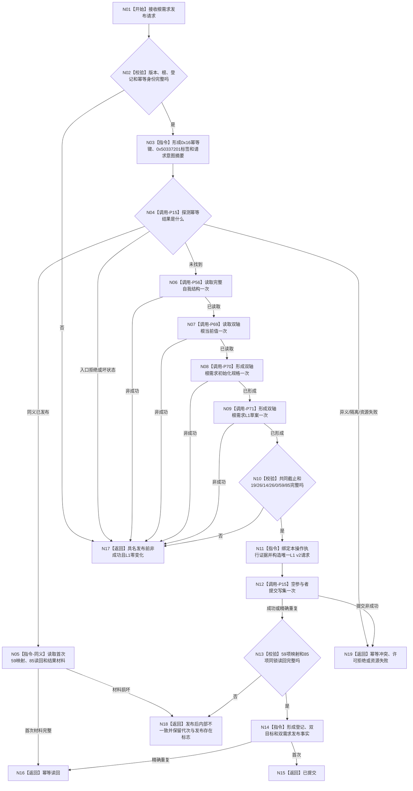

# P72 发布自我双轴根需求函数流程图 v0.1

日期：2026-08-06

状态：设计流程；代码未实现；计划必须待激活

正式依据：4015、4030—4050、5090—5110、6130、6170、7130、
SELF-GOV-CLOSURE v0.2；P15 v0.23、P37、P56、P69—P71 正式设计合同；
`规范/详细设计/20260806_L1-SIMPLIFY-P72-SELF-ROOT-DEMAND-PUBLISH_6130双轴根需求原子发布详细设计_v0.1.md`。

## 单函数流程



## 节点合同

| 节点 | 输入 | 输出 | 事实写入 | 非成功边界 |
| --- | --- | --- | --- | --- |
| N02 | 公开请求 | 纯值准入结论 | 0 | 依赖调用 0 |
| N03 | 合法请求 | 幂等键、标签、领域摘要 | 0 | 全零摘要内部不一致 |
| N04 | 幂等键、摘要 | 未找到/同义/异义/隔离 | 0 | 非未找到全部短路 |
| N05 | 首次账材料 | 原始发布事实 | 0 | P56/P69/P70/P71/提交均 0 |
| N06 | P56 请求 | 完整自我结构事实 | 0 | 最早失败立即返回 |
| N07 | P69 请求 | 同截止双轴当前值事实 | 0 | 不在函数内重读 |
| N08 | P70 请求和两事实 | 两个无父根需求规格 | 0 | 出生值漂移不补造 |
| N09 | P70 结果 | 59 新编码、26 槽、85 读回草案 | 0 | 坏成功内部不一致 |
| N12 | 唯一 L1 v2 请求 | P15 提交结果 | 一次 L1 代次 | P37/P54 调用 0 |
| N13 | 映射与同锁读回 | 完整性结论 | 0 | 不回滚、不补写 |
| N14 | P70 规格、映射、读回 | 完整根需求发布事实 | 0 | 不调用正式需求读取 |

## 固定数量与身份

```text
幂等域0x16；操作标签0x50337201；专项顺序572。
P56/P69/P70/P71首次调用1/1/1/1；同义路径0/0/0/0；P15提交首次最多1、同义0。
节点19、值26、关系14、槽26、退出0、稳定映射59、同锁读回85。
需求角色1—7各一；父角色8、关系19、P37/P54参与者和第二账均为0。
```

## 最大边界

本函数只发布两个冷启动根需求及其目标状态并返回首次/幂等发布事实。它不形成正式当前读取、
父子路径、满足/结算、6170维护、差距、任务、生产装配、恢复或正式集成验收。
