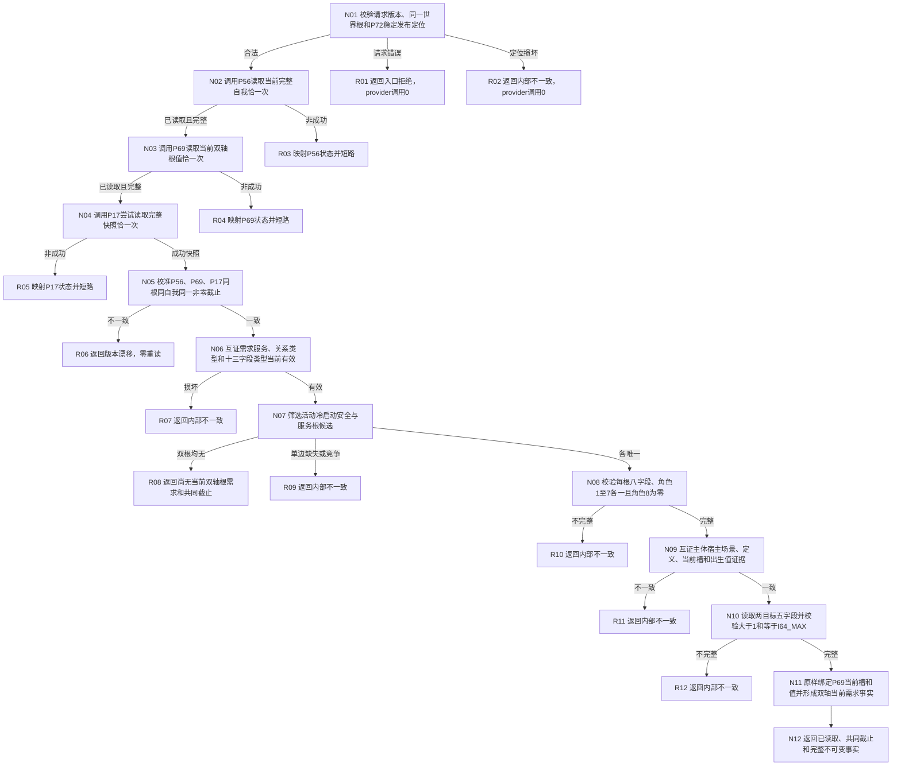

# L1-SIMPLIFY-P73 读取当前自我双轴根需求函数流程图 v0.1

日期：2026-08-06

状态：设计就绪；代码未实现；计划必须待激活

函数：`L1自我根需求读取服务::读取当前自我双轴根需求`

## 流程图

## 节点合同

| 节点 | 输入 | 输出与边界 |
| --- | --- | --- |
| N01 | 公开请求、构造时深复制的P72成功发布事实 | 锁外准入；不得调用P15或P72发布入口 |
| N02 | P56请求 | 只接受唯一完整当前自我；P18/P19/P21由其门禁传递 |
| N03 | P69请求 | 只接受当前双轴根值；P17—P26/P56由其门禁传递 |
| N04 | 正式L1快照请求 | 一次try-lock；许可拒绝立即返回 |
| N05 | 三份成功事实 | 世界根、自我、截止逐字段相同；不内部重读 |
| N06 | P17快照、P72稳定定位 | 只验证当前节点和值槽，不把P72发布代次当当前截止 |
| N07 | 当前字段和值 | 安全/服务各唯一；不按编码或容器顺序挑选 |
| N08 | 两需求及当前关系 | 角色1—7各一，角色8为0；不解释父子路径 |
| N09 | P56/P69/P72见证 | 当前槽来自P69，出生值只作P72来源证据 |
| N10 | 两目标状态及其字段值槽 | 只验证目标合同；当前满足比较调用0 |
| N11—N12 | 已互证材料 | 形成纯值结果；零写入、事务、缓存、维护或装配 |

## 最大边界

本函数只形成截止代次上的安全/服务活动无父根需求当前读取事实。它不形成满足、父子路径、
6170维护输入、差距、条件性子需求、任务、生产装配、恢复或STEP-5完成事实。
