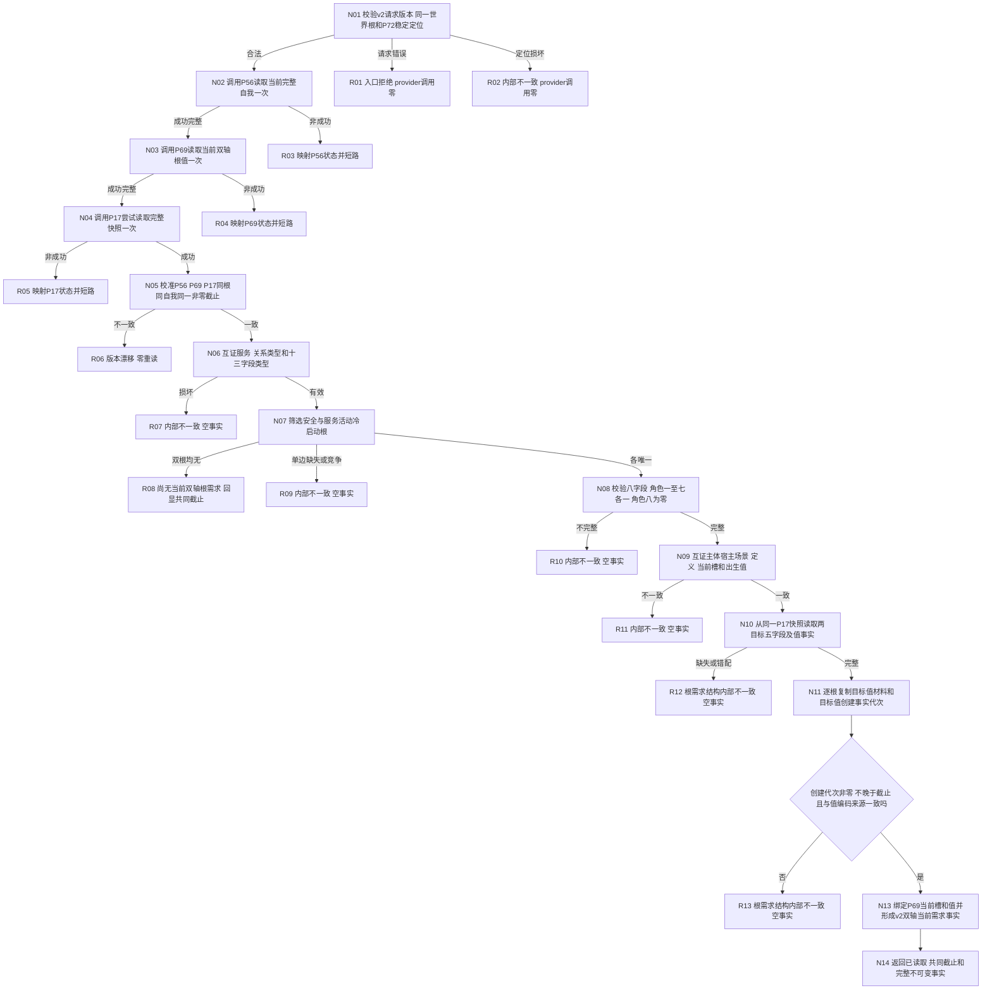

# L1-SIMPLIFY-P73 读取当前自我双轴根需求函数流程图 v0.2

日期：2026-08-06

状态：修订设计就绪；代码未实现；计划必须待激活

函数：`L1自我根需求读取服务::读取当前自我双轴根需求`

## 新字段节点合同

| 节点 | 唯一来源 | 禁止替代 |
| --- | --- | --- |
| N10 | P17同一快照中目标值当前槽指向的值事实 | P72发布读回、另一快照 |
| N11 | 该值事实的I64材料、稳定编码和`创建事实代次`，写入`目标值创建事实代次` | 目标状态创建代次、共同截止 |
| N12 | 非零、创建代次不晚于G、编码/材料/所属/属性/来源一致 | 补零、最小/最大代次、容器顺序 |
| N13 | 安全与服务各自独立的目标值版本见证 | 共用一个创建代次 |

最大边界：本函数仍只形成截止代次上的安全/服务活动无父根需求当前读取事实，并新增目标值
事实版本回显。它不调用P74、不裁决满足、不读取父子路径、不形成6170维护、任务或装配事实。
