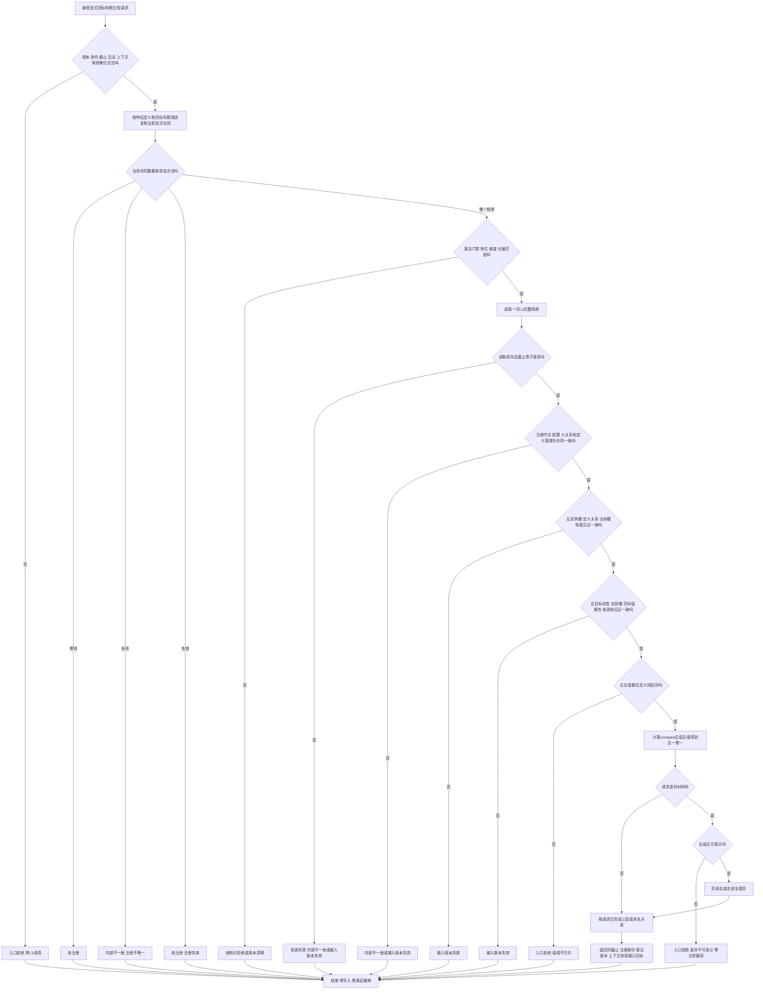

# L1-SIMPLIFY-P74 比较显式 I64 目标函数流程图 v0.1

更新时间：2026-08-06

本图只描述 `特征比较服务::比较显式I64目标`。登记、满足模板命中、需求维护和装配不进入本函数。

最大边界：成功只证明显式目标值与当前值在一个已登记比较合同和同一 L1 截止内形成正式比较结果；它不证明 P73 当前需求目标模板已命中，不形成满足、维护、路径、任务或装配事实。
