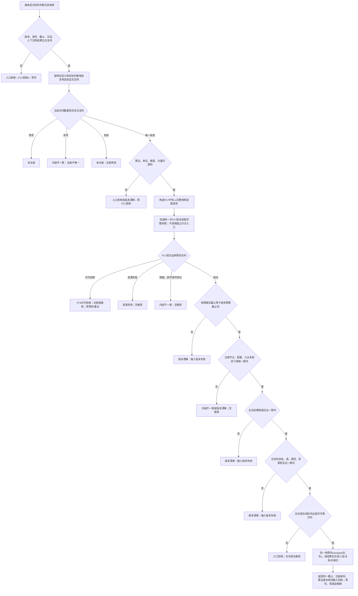

# L1-SIMPLIFY-P74 比较显式 I64 目标函数流程图 v0.2

更新时间：2026-08-06

创建基线：`2527f7de2c0daedf21e380757cd22a087cfd45d4`

具名退回：`P75-P74-BLOCKING-SNAPSHOT-VS-NONBLOCKING-COORDINATOR`

本图只描述 `特征比较服务::比较显式I64目标`。P74 不读取 P73/P75，不修改 P17；
P17 的独立事实代次入口在本函数中调用次数固定为 0。

非阻塞边界：P74 不持有 P17 锁、许可、仓库或事务；不等待、不 sleep、不重试，
不拼接第二快照。P17 返回的 `事实截止代次` 是本函数唯一截止来源。比较方向、
三态、具名关系和差异算法沿用 v0.1，不表示当前满足或需求事实。
