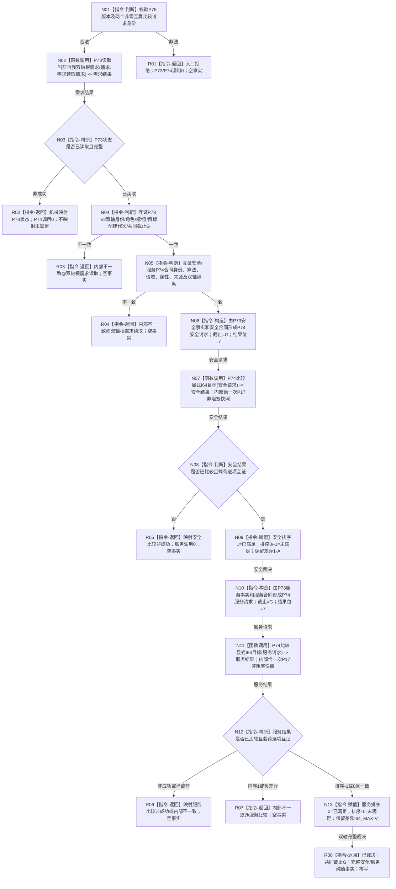

# L1-SIMPLIFY-P75 判定当前自我双轴根需求满足函数流程图 v0.1

更新时间：2026-08-06

创建基线：`1000dde5fc3687d37ba48dc4873b1922bb3d950d`

计划身份：`L1-SIMPLIFY-P75-SELF-ROOT-DEMAND-CURRENT-SATISFACTION`

## 依据

```text
规范/6130_子规范_自我根特征抽象定义与自检缺口_20260720.md
规范/4130_子规范_特征值三态比较底层逻辑_20260720.md
规范/4180_子规范_特征值域差异算子与比较算法注册.md
流程图/20260806_L1-SIMPLIFY-P73-SELF-ROOT-DEMAND-READ_读取当前自我双轴根需求函数流程图_v0.2.md
流程图/20260806_L1-SIMPLIFY-P74-I64-EXPLICIT-TARGET-COMPARE_比较显式I64目标函数流程图_v0.2.md
P73 v0.2真实plan blob b1d57ab1a1c9aeada69c152da439669732c6973c
P74 v0.2真实plan blob 25f8a5b3acbf6f5deb7079afbf62b9d03a34b9c7
```

## 身份与边界

本图是P75目标单函数正式设计图，只描述一个待新增根函数。它消费P73/P74冻结接口，零写、
端到端非阻塞；不表示上游已经实现，不写满足事实，不进入6170、父子/路径、任务或装配。

## 函数合同

```text
根函数：L1自我根需求当前满足服务::判定当前自我双轴根需求满足
归属模块 / 文件 / 层级：海中鱼巣.领域.服务.L1自我根需求当前满足 / 海中鱼巣/领域/服务.L1自我根需求当前满足.ixx / 领域协调
现有或待新增：待新增
完整签名：自我双轴根需求当前满足结果 判定当前自我双轴根需求满足(const 自我双轴根需求当前满足请求& 请求) const
参数：请求；const引用输入；调用期有效；版本及两个非零互异比较身份必须合法
返回结果：自有纯值；仅已裁决携带完整双轴事实；非成功无部分事实
被调函数流程图：P73读取当前自我双轴根需求函数流程图v0.2；P74比较显式I64目标函数流程图v0.2
```

## 流程图



## 节点合同

| 节点 | 类型 | 参数 / 输入绑定 | 结果 / 输出绑定 | 事实读写 | 后继条件 | 验证 |
| --- | --- | --- | --- | --- | --- | --- |
| N01 | 本函数内判断 | P75请求 | 合法性 | 零读写 | 合法/非法 | 版本、身份非零互异 |
| N02 | 函数调用 | `需求读取请求` -> P73请求 | P73结果 -> 需求结果 | P73只读 | 调用完成 | 恰一次 |
| N03—N05 | 本函数内判断 | P73结果、两个P74合同 | 完整共同截止输入 | 只读纯值 | 一致/拒绝 | 合同v2、G非零、双轴互异 |
| N06 | 本函数内构造 | P73安全事实、G、安全合同、身份 | 安全P74请求 | 零写 | 构造完成 | 左右五见证逐项映射 |
| N07 | 函数调用 | 安全请求 -> P74请求 | P74结果 -> 安全结果 | P74只读 | 调用完成 | P74一次；内部P17 try一次 |
| N08—N09 | 本函数内判断/赋值 | 安全结果 | 安全满足裁决 | 零写 | 成功/拒绝 | 三态/关系/差异/回执互证 |
| N10 | 本函数内构造 | P73服务事实、G、服务合同、身份 | 服务P74请求 | 零写 | 构造完成 | 目标值I64_MAX，不是0 |
| N11 | 函数调用 | 服务请求 -> P74请求 | P74结果 -> 服务结果 | P74只读 | 调用完成 | P74一次；内部P17 try一次 |
| N12—N13 | 本函数内判断/赋值 | 服务结果 | 服务满足裁决 | 零写 | 成功/拒绝 | 排序1与负差异拒绝 |
| R01—R08 | 本函数内返回 | 当前阶段材料 | 结构化结果 | 零写 | 终止 | 非成功无部分事实 |

## 关键边界

```text
P75直接P17/P69/P72/L1调用=0；不建立第二需求或目标解释者。
安全目标值=1，满足期望排序=1；服务目标值=I64_MAX，满足期望排序=0。
许可竞争、尚无、漂移、缺值或内部不一致绝不伪装成未满足。
不等待、不sleep、不重试、不锁、不缓存、不写满足/需求/L1事实。
```
