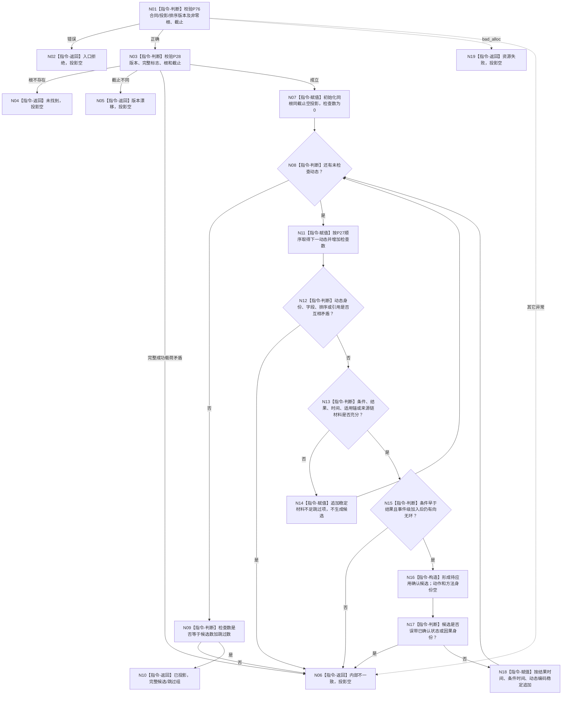

# 投影当前世界动态事件因果候选函数流程图 v0.1

更新时间：2026-08-06

## 依据

用户动态到因果机器语义裁决；1190、4190、4210、4220、4310、4320；P27—P29正式设计；P76配套详细设计。

## 身份与边界

本图是待新增单函数的正式施工图。它只形成调用方拥有的待应用确认纯值候选；零读取调用、零写入、零确认、零日志。专项日志由同一生产程序中的外层观察薄入口产生，不属于本函数。

## 函数合同

```text
根函数：投影当前世界动态事件因果候选
归属模块：海中鱼巣.领域.服务.L1动态因果候选投影
物理文件：海中鱼巣/领域/服务.L1动态因果候选投影.ixx
层级：动态到因果候选纯值投影provider
现有或待新增：待新增
完整签名：当前世界动态因果候选投影结果 投影当前世界动态事件因果候选(const 当前世界动态因果候选投影请求& 请求, const 完整世界事实快照& 快照)
参数请求：只读借用，调用期有效，不保存
参数快照：只读借用，必须来自P29/P28成功结果，不保存
返回结果：调用方拥有的结构化结果；非成功零投影
被调函数流程图：无；本函数不调用provider或非平凡业务函数
```

## 流程图



## 节点合同

| 节点组 | 输入 | 输出 | 事实读写 | 关键验证 |
| --- | --- | --- | --- | --- |
| N01—N06 | 请求、快照 | 结构化非成功或继续 | 只读纯值，写入0 | 状态分账无混淆 |
| N07—N10 | 合法完整快照 | 完整空或非空投影 | 只构造调用方结果 | 检查数=候选数+跳过数 |
| N11—N14 | 单条动态 | 跳过项或继续 | 不补造材料 | 知识不足非错误 |
| N15—N18 | 材料充分动态 | 待确认候选 | 不形成稳定因果身份 | 事件时间DAG；类型往复允许 |
| N19 | 分配失败 | 资源失败 | 写入0 | 零部分投影 |

## 关键边界

只允许同一个生产程序通过既有或正式冻结自检启动模式薄登记调用本函数并写正式观察日志；不得新增exe、独立自检目标、第二装配、测试专用DTO或替身入口。日志不是本函数结果、机器事实、恢复介质或因果确认依据。

本图只覆盖同一生产进程正常存活期间的一次纯值调用；程序崩溃、异常终止、断电、重启后续作、跨进程恢复和跨进程幂等重放均不在图内。
