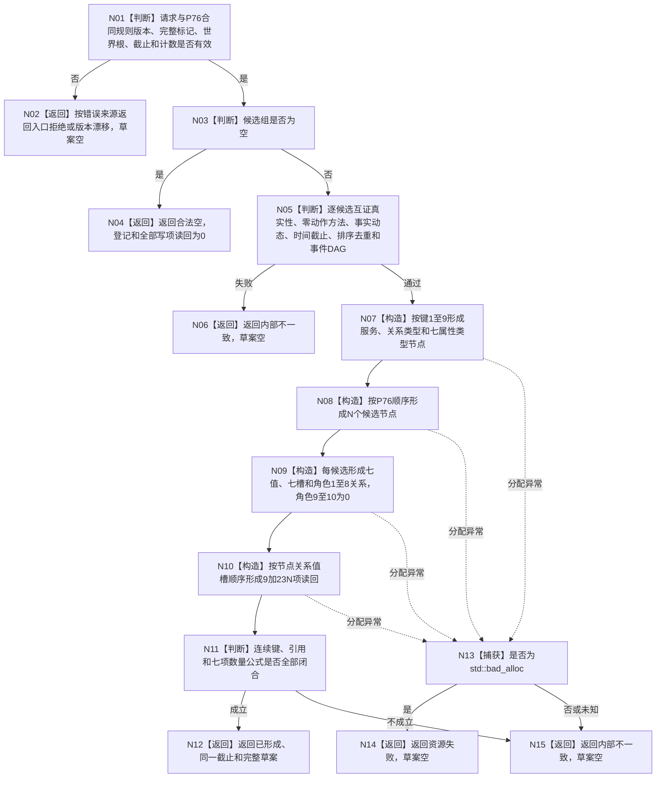

# P77 形成动态因果候选首次批次 L1 草案函数流程图 v0.1

更新时间：2026-08-06

## 依据与边界

依据用户动态因果裁决、4015、4030—4050、1190、4190、4210、4220、4310、4320、6150
以及 P76 v0.1。根函数只形成纯值 L1 写集与读回草案，写入数为0；不调用 P76 provider、
P15/L1、动作/方法服务或安全图 provider，不形成发布、读取、应用确认、STEP-7或装配。

## 函数合同

```text
根函数：形成动态因果候选首次批次L1草案
归属模块：海中鱼巣.领域.数据操作.L1动态因果候选首次写集
物理文件：海中鱼巣/领域/数据操作.L1动态因果候选首次写集.ixx
层级：L2因果领域纯值数据操作
完整签名：动态因果候选首次批次L1草案结果 L1动态因果候选首次写集数据操作::形成动态因果候选首次批次L1草案(const 动态因果候选首次写集请求& 请求, const 当前世界动态因果候选投影& 投影) const
输入：P77请求和调用方已有的P76成功投影，均只读
输出：已形成携带唯一完整非空草案；合法空及其它非成功均不携带草案
被调函数流程图：无；全部节点是本函数内判断、构造、捕获或返回
```

## 流程图



## 节点合同

| 节点 | 输入 | 输出 | 事实写入 | 核心验证 |
| --- | --- | --- | --- | --- |
| N01—N02 | 请求、P76投影 | 入口/版本分类 | 0 | 截止、计数、版本、完整性 |
| N03—N04 | 候选组 | 合法空 | 0 | 空组不预建登记 |
| N05—N06 | 全部候选 | 互证结论 | 0 | 待确认、零动作、排序、DAG |
| N07 | 固定合同 | 9共享节点 | 0 | 2普通+4 I64属性类型+3 U64组属性类型 |
| N08 | 候选组 | N候选节点 | 0 | 顺序与P76相同 |
| N09 | 候选和共享键 | 7N值、7N槽、8N关系 | 0 | 角色1—8；9/10为0 |
| N10 | 全部草案项 | 9+23N读回 | 0 | 节点/关系/值/槽精确覆盖 |
| N11—N12 | 完整草案 | 已形成 | 0 | 9+N/7N/8N/7N/0/9+16N/9+23N |
| N13—N15 | 异常或矛盾 | 资源失败/内部不一致 | 0 | 非成功无部分草案 |

## 验证边界

1. 单 Mermaid、单 TD 流程根、单根函数、无 HTML 配对产物。
2. 专项身份 `L1-SIMPLIFY-P77-S01`、顺序577，目标外占用必须为0。
3. 合法空为非错误且零登记；非空草案只承载待应用确认候选。
4. 相同输入/并发确定，P76/P15/L1/provider/日志/时钟调用为0。
5. 只用同一生产程序构建运行和正式日志做人读观察；日志不是机器事实。
6. 本图未覆盖程序崩溃与跨进程恢复。
