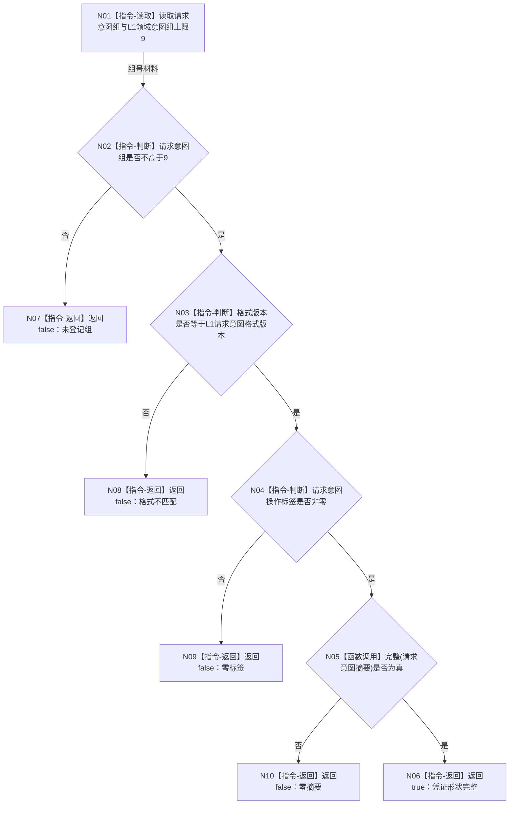

# L1-SIMPLIFY-P78-DYNAMIC-CAUSAL-INTENT-GROUP
# 校验 L1 领域意图凭证完整函数流程图 v0.1

更新时间：2026-08-06

## 依据

```text
用户动态因果、单生产程序、日志观察与暂缓崩溃恢复裁决
P14 v0.3正式设计f7303ea8d842727891065584575535f6d126133d
P14 v0.3 plan blob 13d936c815f57becc612f55339bc12065a9e3592
P76/P77正式设计
规范/详细设计/20260806_L1-SIMPLIFY-P78-DYNAMIC-CAUSAL-INTENT-GROUP_L1动态因果候选领域意图组G9扩展详细设计_v0.1.md
海中鱼巣/核心/L1事实基座.数据.h:126—136、195—199
```

## 身份与边界

本图是P78目标单函数正式设计图，只描述现有唯一纯值根函数在G9合法上限后的过程。它不
描述生产G9请求DTO摘要、幂等探测内部、L1提交、候选发布、恢复或生产装配。

## 函数合同

```text
根函数：L1领域意图凭证完整
归属模块/文件/层级：海中鱼巣.核心.合同.L1事实基座 / 海中鱼巣/核心/L1事实基座.数据.h / 核心公共边界
现有或待新增：现有函数的最小扩展；不新增第二验证器
完整签名：inline bool L1领域意图凭证完整(const L1领域意图凭证& 凭证) noexcept
参数：凭证；const L1领域意图凭证&；只读借用；调用期间有效；无空引用形态
返回结果：bool；四项门禁全部满足返回true，任一不满足返回false
事实读写：只读参数与编译期常量；零事实写入、零锁、零分配、零provider调用
被调函数流程图：无；完整(凭证.请求意图摘要)为既有非零摘要纯值判断
```

## 流程图



## 节点合同

| 节点 | 类型 | 输入绑定 | 输出 | 事实读写 | 后继 | 验证 |
| --- | --- | --- | --- | --- | --- | --- |
| N01 | 本函数内指令 | `凭证.请求意图组`、编译期上限9 | 两个U8材料 | 只读 | N02 | G0—G10矩阵 |
| N02 | 本函数内判断 | 组号、上限 | 布尔 | 零写 | 是N03/否N07 | G9真、G10假 |
| N03 | 本函数内判断 | 凭证格式、格式常量 | 布尔 | 零写 | 是N04/否N08 | G9错格式 |
| N04 | 本函数内判断 | 操作标签 | 布尔 | 零写 | 是N05/否N09 | G9零标签 |
| N05 | 函数调用 | 摘要->`完整`只读参数 | 布尔 | 零写 | 是N06/否N10 | G9零/非零摘要 |
| N06 | 本函数内返回 | 四项门禁真 | `true` | 零写 | 返回 | G0—G9合法形状 |
| N07 | 本函数内返回 | 组号大于9 | `false` | 零写 | 返回 | G10拒绝 |
| N08 | 本函数内返回 | 格式不匹配 | `false` | 零写 | 返回 | 错格式拒绝 |
| N09 | 本函数内返回 | 零标签 | `false` | 零写 | 返回 | 零标签拒绝 |
| N10 | 本函数内返回 | 零摘要 | `false` | 零写 | 返回 | 零摘要拒绝 |

## 关键边界

```text
G0保持核心fallback；G1—G8逐字兼容；P14继续为G7；G9专属动态因果候选；G10+拒绝。
true只表示凭证形状完整，不表示摘要正确、幂等命中、提交成功或事实发布。
本函数直接调用P14/P76/P77/L1仓库/动作/方法/日志/恢复入口均为0。
专项L1-SIMPLIFY-P78-S01顺序578只登记在同一生产程序既有自检运行器。
日志仅作人读观察；未覆盖程序崩溃、重启与跨进程恢复。
```

## 验证

1. 一图一个根函数，完整签名、参数、返回与零写边界齐全。
2. G0—G10、错格式、零标签和零摘要均有确定返回。
3. 单Mermaid、单`flowchart TD`，不生成HTML。
4. no-index diff check、strict、顺序578与G9身份门禁通过。
