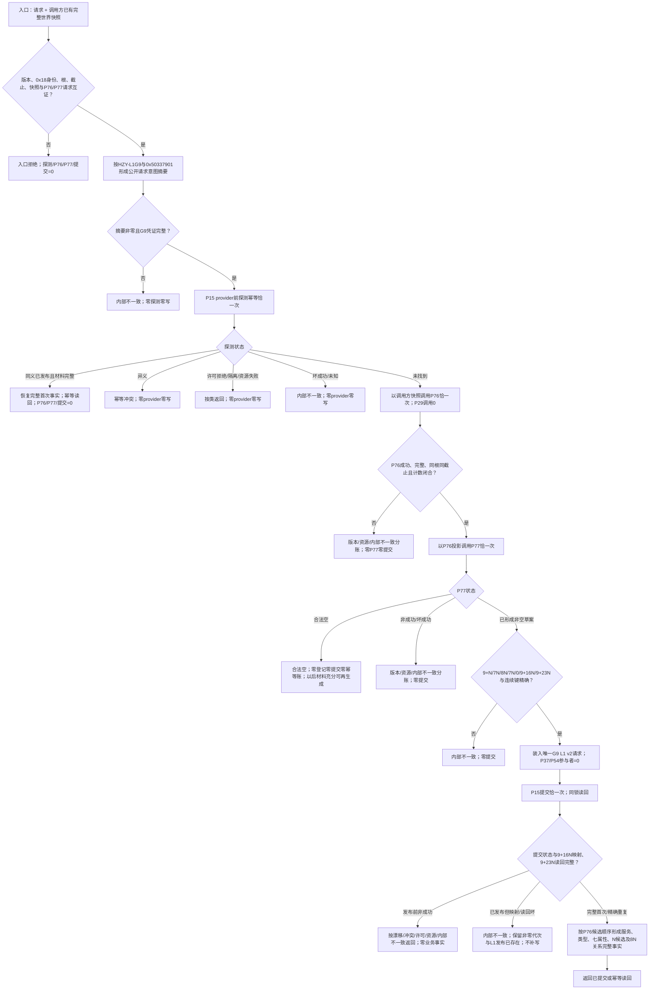

# 发布首次动态因果候选批次函数流程图 v0.1

函数：`L1动态因果候选发布服务::发布首次动态因果候选批次`

```mermaid
flowchart TD
  A["入口：请求 + 调用方已有完整世界快照"] --> B{"版本、0x18身份、根、截止、快照与P76/P77请求互证？"}
  B -- 否 --> R1["入口拒绝；探测/P76/P77/提交=0"]
  B -- 是 --> C["按HZY-L1G9与0x50337901形成公开请求意图摘要"]
  C --> D{"摘要非零且G9凭证完整？"}
  D -- 否 --> R2["内部不一致；零探测零写"]
  D -- 是 --> E["P15 provider前探测幂等恰一次"]
  E --> F{"探测状态"}
  F -- 同义已发布且材料完整 --> R3["恢复完整首次事实；幂等读回；P76/P77/提交=0"]
  F -- 异义 --> R4["幂等冲突；零provider零写"]
  F -- 许可拒绝/隔离/资源失败 --> R5["按类返回；零provider零写"]
  F -- 坏成功/未知 --> R6["内部不一致；零provider零写"]
  F -- 未找到 --> G["以调用方快照调用P76恰一次；P29调用0"]
  G --> H{"P76成功、完整、同根同截止且计数闭合？"}
  H -- 否 --> R7["版本/资源/内部不一致分账；零P77零提交"]
  H -- 是 --> I["以P76投影调用P77恰一次"]
  I --> J{"P77状态"}
  J -- 合法空 --> R8["合法空；零登记零提交零幂等账；以后材料充分可再生成"]
  J -- 非成功/坏成功 --> R9["版本/资源/内部不一致分账；零提交"]
  J -- 已形成非空草案 --> K{"9+N/7N/8N/7N/0/9+16N/9+23N与连续键精确？"}
  K -- 否 --> R10["内部不一致；零提交"]
  K -- 是 --> L["装入唯一G9 L1 v2请求；P37/P54参与者=0"]
  L --> M["P15提交恰一次；同锁读回"]
  M --> N{"提交状态与9+16N映射、9+23N读回完整？"}
  N -- 发布前非成功 --> R11["按漂移/冲突/许可/资源/内部不一致返回；零业务事实"]
  N -- 已发布但映射/读回坏 --> R12["内部不一致；保留非零代次与L1发布已存在；不补写"]
  N -- 完整首次/精确重复 --> O["按P76候选顺序形成服务、类型、七属性、N候选及8N关系完整事实"]
  O --> R13["返回已提交或幂等读回"]
```

边界：单次调用不读P29、不等待、不重试、不写第二账；候选仍为待应用确认。正式日志只作
同一生产程序的人读观察，不是候选事实。未覆盖程序崩溃、重启与跨进程恢复。
