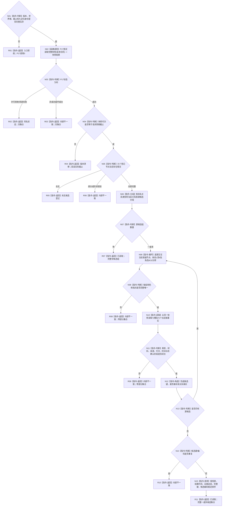

# 读取当前动态因果候选函数流程图 v0.1

更新时间：2026-08-06

## 依据与身份边界

```text
正式依据：0050、1190、4015、4030—4050、4190、4210、4220、4310
冻结上游：P17、P76—P79正式设计/计划
图身份：P80目标单函数施工图；代码尚未实现；不得把图中目标行为宣称为当前能力
最大边界：只读取当前待应用确认候选；零写、零确认、零安全图
```

## 函数合同

```text
根函数：L1动态因果候选读取服务::读取当前动态因果候选
归属模块：海中鱼巣.领域.服务.L1动态因果候选读取
现有或待新增：待新增
完整签名：动态因果候选当前读取结果 读取当前动态因果候选(const 动态因果候选当前读取请求& 请求) const
参数：请求为只读借用，同步调用期间有效；包含世界根、预期截止和P79登记定位
返回结果：调用方拥有的不可变值；仅已读取携带完整集合
```

## 流程图



## 节点合同

| 节点 | 类型 | 参数 / 输入绑定 | 结果 / 输出绑定 | 事实读写 | 后继与验证 |
| --- | --- | --- | --- | --- | --- |
| N01 | 指令-判断 | `请求`全部公开字段 | 准入布尔值 | 零读零写 | 无效直达R01；证明P17调用0 |
| N02 | 函数调用 | P17请求合同由固定L1版本形成 | `L1完整快照结果` | 非阻塞只读L1 | 恰调用一次；不得改用阻塞入口 |
| N03—N05 | 指令-判断 | P17状态、快照代次、九定位节点 | 结构化分支 | 只读返回副本 | 状态、漂移、登记尚无/损坏逐类验证 |
| N06—N07 | 指令-分组/判断 | 具名关系类型的当前关系 | 按源候选分组 | 只读快照 | 零组到R07；不按“最新”补选 |
| N08—N09 | 指令-循环/判断 | 单个源组 | 角色1—8完整性 | 只读关系副本 | 角色9/10或未知/重复角色到R08 |
| N10—N11 | 指令-读取/判断 | 候选节点七槽和对应值 | 七属性完整性 | 只读同一快照 | 材料、来源、代次、时间逐项验证 |
| N12—N14 | 指令-构造/判断 | 已互证关系和值 | 候选事实、唯一性 | 零写 | 全部源处理后拒绝重复键/编码 |
| N15 | 指令-排序 | 完整候选组 | 稳定顺序候选组 | 零写 | 输入顺序扰动结果不变 |
| R01—R10 | 指令-返回 | 对应非成功原因 | 无候选集合的具名结果 | 零写 | 不返回部分事实 |
| R11 | 指令-返回 | 完整稳定排序候选组 | `已读取`完整集合 | 零写 | 候选数允许一或多；零候选由R07返回 |

## 关键边界

P17恰调用一次；P15/P29/P76/P79及全部写入调用0。零候选与登记尚无分账；任何半结构不降格
为空。结果只对回显截止有效，候选仍待应用确认。日志不是机器事实；未覆盖崩溃与跨进程恢复。
