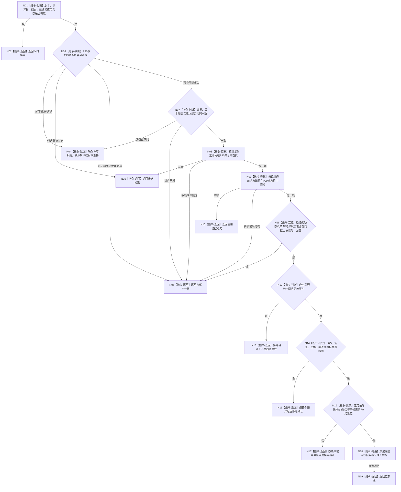

# 形成动态因果候选应用确认准入规格函数流程图 v0.1

更新时间：2026-08-06

## 依据

```text
用户裁决：因果来自动态、允许被动因果、候选须经后继实际应用确认、零动作前提
规范/0050_项目通用机器逻辑与禁止性规则总纲_20260721.md
规范/1190_根规范_因果_20260720.md
规范/4310_子规范_因果补完与因果信息用法_20260720.md
P27/P28/P29、P76、P79、P80 v0.1正式设计合同
```

## 身份与边界

本图是待新增单函数的正式施工图，只形成零写纯值准入规格。它不调用provider、不确认或退出
候选、不发布因果、不统计可信度、不形成安全图。P80和P29结果由调用方经正式入口取得。

## 函数合同

```text
根函数：形成动态因果候选应用确认准入规格
归属模块：海中鱼巣.领域.服务.L1动态因果候选应用确认准入
物理文件：海中鱼巣/领域/服务.L1动态因果候选应用确认准入.ixx
现有或待新增：待新增
完整签名：动态因果候选应用确认准入结果 形成动态因果候选应用确认准入规格(
    const 动态因果候选应用确认准入请求& 请求,
    const 动态因果候选当前读取结果& 候选读取结果,
    const 完整世界快照组合结果& 世界快照结果)
参数：三个const借用纯值；函数不保存引用
返回结果：已形成/候选尚无/应用证据尚无/拒绝确认/入口拒绝/版本漂移/许可拒绝/资源失败/内部不一致
被调函数流程图：无；函数调用数0
```

## 流程图



## 节点合同

| 节点 | 类型 | 输入绑定 | 输出 | 事实读写 | 验证 |
| --- | --- | --- | --- | --- | --- |
| N01—N07 | 本函数内指令 | 请求、两个上游结果 | 入口或上游状态 | 只读；零写 | 版本、状态、共同截止矩阵 |
| N08—N11 | 本函数内指令 | 候选编码、应用动态编码、P80集合、P29快照 | 唯一候选与完整两事件材料 | 只读；零扫描替换 | 0/1/N、重复、半结构 |
| N12—N17 | 本函数内指令 | 原事件与应用事件 | 首个稳定拒绝原因 | 只读；零确认 | 时间、锚点、A→B/B→A |
| N18—N19 | 本函数内指令 | 全部互证材料 | 完整纯值规格 | 零节点/关系/值/槽/退出 | 字段逐项相等、完整标志 |

## 关键边界

```text
只比较请求具名应用动态，不自动寻找有利证据；其它机会和反例留给后继可信度边界。
允许类型/对象层后续B→A，但它不能确认A→B；事件级时间保持严格向前。
角色6—8、动作身份、方法运行身份均为0；日志不是准入或确认事实。
本图未覆盖确认发布、候选退出、已确认读取、安全图、STEP-7、崩溃或跨进程恢复。
```
