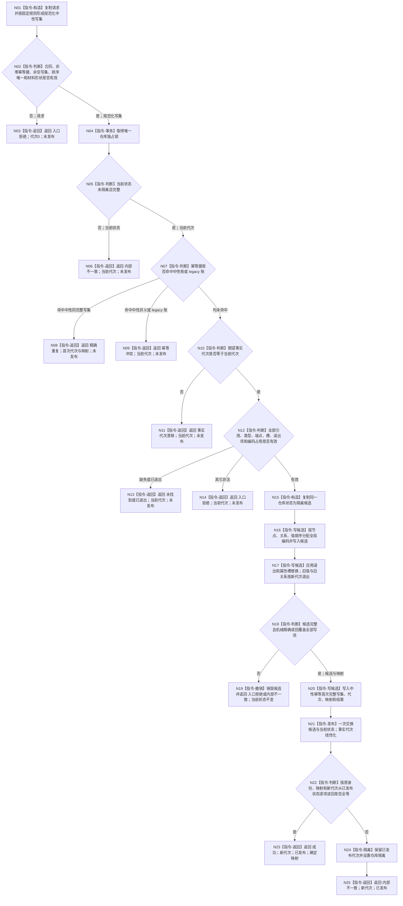

# L1-DATA-LAYER-COMPLETE-P1-NEUTRAL-CRUD 提交中性写集函数流程图 v0.1

更新时间：2026-08-07

## 依据

```text
4015 v0.4
4040 v1.4
4050 v1.2
ACCEPTANCE-01 v0.2
当前仓库.L1事实基座.ixx 的单锁、候选复制、最后交换与精确读取事实
配套详细设计 v0.1
```

## 身份与边界

正式目标单函数图。本图冻结新增仓库写根，不表示当前代码已经实现。

## 函数合同

```text
根函数：L1事实基座仓库::提交中性写集
归属模块 / 文件 / 层级：海中鱼巣.核心.仓库.L1事实基座 / 海中鱼巣/核心/仓库.L1事实基座.ixx / L1
现有或待新增：待新增
完整签名：L1中性写入结果 提交中性写集(const L1中性写集请求& 请求)
参数：请求；const 引用；调用方拥有且覆盖本次调用；非法合同、零幂等键、空写集或坏引用必须零变化拒绝
返回结果：L1中性写入结果；值式；携带状态、合同、幂等键、代次、是否发布、重试边界和适用映射
被调函数流程图：无；图中规范化、转换、候选应用和读回均作为本根内具体指令冻结
```

## 流程图



## 节点合同

| 节点组 | 类型 | 输入 | 输出 | 事实读写 | 后继 / 验证 |
| --- | --- | --- | --- | --- | --- |
| N01—N03 | 本函数内指令 | 原请求 | 规范化写集或入口拒绝 | 零仓库访问 | 非法请求前后公开代次相同 |
| N04—N14 | 本函数内指令 | 规范化写集、当前状态 | 精确重复 / 冲突 / 漂移 / 拒绝或施工许可 | 独占锁内只读当前状态 | 所有写前分支零候选、零代次推进 |
| N15—N20 | 本函数内指令 | 同一当前代次和合法写集 | 完整候选、映射、首次幂等记录 | 只写隔离候选 | 任一失败销毁候选，当前状态不变 |
| N21 | 本函数内指令 | 完整候选 | 新已发布状态 | 唯一线性化写点 | 全部事实共同可见 |
| N22—N25 | 本函数内指令 | 已发布状态、原映射 | 成功或发布后内部不一致 | 只读已发布状态；必要时置隔离 | 成功全等；失败不得伪装回滚 |

## 关键边界

```text
幂等同义必须逐字段比较完整规范化中性写集，不能比较摘要。
中性写前拒绝不写审计、执行证据、领域见证或恢复材料。
中性与 legacy 幂等键交叉占用固定为冲突。
全部可能分配动作在 N21 前完成；N21 后不允许抛出导致结果未知。
公开读取只精确访问稳定编码，不调用全快照。
```

## 验证

本图只包含一个 Mermaid、一个 `flowchart TD` 和一个根函数。代码实现后由生产二进制外黑盒驱动覆盖每个返回分支及发布前后权威代次。
