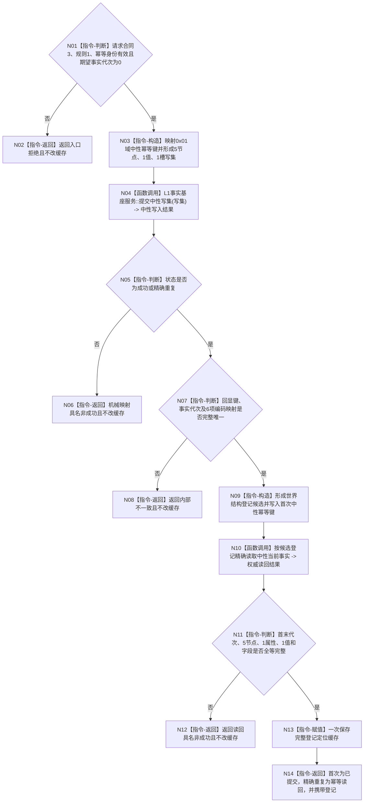

# L1-DATA-LAYER-COMPLETE-P2 世界登记服务建立空世界函数流程图 v0.1

更新时间：2026-08-07

## 依据

```text
4015 v0.5
4030 v1.3
4200 v1.2
L1-DATA-LAYER-COMPLETE-P1-NEUTRAL-CRUD v0.2 正式设计包
HEAD c442d9c30f12fca6c928f2049444f5cfbb3406ce 的世界登记、生产启动与 P1 中性 CRUD 正式代码
```

## 身份与边界

本图是 P2 v0.1 的目标单函数施工图，只冻结 `世界登记服务::建立空世界`。生产调用接线、配置和候选发布顺序由配套详细设计约束，不作为本图第二根函数。

## 函数合同

```text
根函数：世界登记服务::建立空世界
归属模块 / 文件 / 层级：海中鱼巣.领域.服务.世界登记 / 海中鱼巣/领域/服务.世界登记.ixx / L2
现有或待新增：现有函数原位迁移
完整签名：世界登记结果 建立空世界(const 世界登记建立请求& 请求)
参数：请求；const 引用输入；调用期只读；非法版本、规则、身份或非零期望代次拒绝
返回结果：世界登记结果；调用方值式拥有；成功、幂等读回或具名非成功
被调函数流程图：无；P1 中性入口按正式公共合同调用，不在本图展开其内部事务
```

## 流程图



## 节点合同

| 节点 | 类型 | 参数 / 输入绑定 | 结果 / 输出绑定 | 事实读写 | 后继条件 | 验证 |
| --- | --- | --- | --- | --- | --- | --- |
| N01 | 指令-判断 | `请求` | 合法 / 非法 | 无 | 布尔分支 | 非零期望代次拒绝 |
| N02 | 指令-返回 | 非法请求 | `入口拒绝` | 零变化 | 返回 | 缓存不变 |
| N03 | 指令-构造 | 合法请求 | 完整中性写集 | 仅局部值 | 构造完成 | 无业务标签 / 意图 / 见证 |
| N04 | 函数调用 | `写集 -> 请求` | `中性写入结果 -> 写入` | L1 可原子发布 | 调用完成 | 恰一次调用，无预探测 |
| N05 | 指令-判断 | `写入.状态` | 成功类 / 非成功类 | 无 | 状态分支 | 只接受成功 / 精确重复 |
| N06 | 指令-返回 | 中性非成功 | 世界登记具名非成功 | 不新增缓存 | 返回 | 状态映射表全覆盖 |
| N07 | 指令-判断 | 写入回显、代次、映射 | 完整 / 矛盾 | 只读结果 | 布尔分支 | 本地键1—6唯一 |
| N08 | 指令-返回 | 坏成功 | `内部不一致` | 不新增缓存 | 返回 | 不做补救写 |
| N09 | 指令-构造 | 请求和编码映射 | 登记候选 | 仅局部值 | 构造完成 | 技术键等于0x01域映射 |
| N10 | 函数调用 | 候选登记 | 权威读回结果 | 只读 L1 当前事实 | 调用完成 | 两代次、5节点、1属性、1值 |
| N11 | 指令-判断 | 权威读回 | 完整 / 非成功 | 无 | 布尔分支 | 不接受混代或部分材料 |
| N12 | 指令-返回 | 读回失败 | 漂移 / 资源 / 内部不一致 | 不新增缓存 | 返回 | 日志不参与状态 |
| N13 | 指令-赋值 | 完整登记 | `登记_` | 只写消费者定位缓存 | 赋值后 | 恰一次、缓存非权威 |
| N14 | 指令-返回 | 写入种类、登记 | 结构化成功结果 | 无 | 返回 | 首次 / 重复精确分账 |

## 关键边界

```text
根函数不调用 legacy 提交、幂等预探测、完整快照、审计、恢复、SQL 或旧仓。
根函数不调用系统角色、场景、存在、特征、状态、动态或方法服务。
中性提交的发布后读回不替代消费者自己的登记字段复核。
读取失败不否认可能已经成立的 L1 发布；只返回结构化非成功且不得第二次写入补救。
本图不证明幂等已被真实生产重复覆盖，也不证明整个 L1 完善。
```
