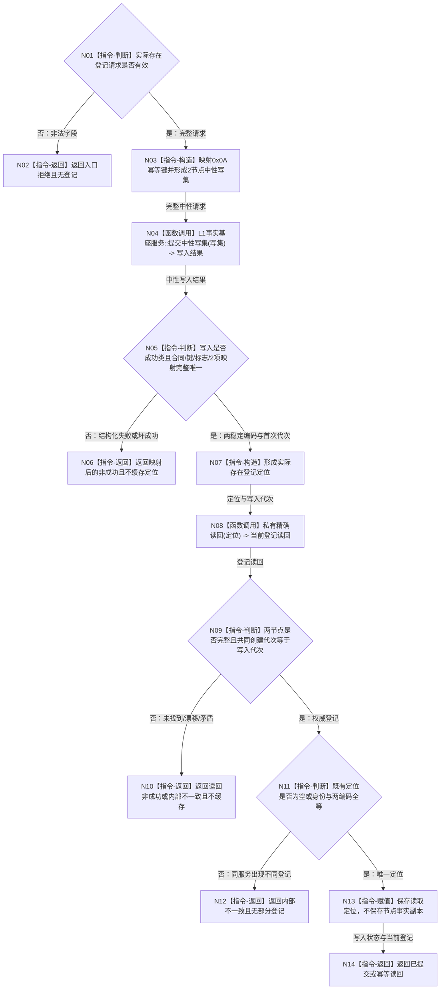

# L1-DATA-LAYER-COMPLETE-P4 建立实际存在登记函数流程图 v0.1

更新时间：2026-08-07

## 依据

```text
4015 v0.5、4030 v1.3、4200 v1.2
规范/详细设计/20260807_L1-DATA-LAYER-COMPLETE-P4-EXISTENCE-REGISTRY-CONSUMER_实际存在结构登记真实消费者中性写读闭环详细设计_v0.1.md
当前 海中鱼巣/领域/服务.L1实际存在.ixx
```

## 身份与边界

正式目标单函数流程图。只冻结 L2 存在事实所有者的一个公开登记根；生产启动、后续场景中实际存在创建和 L1 内部事务不是本图根函数。

## 函数合同

```text
根函数：L1实际存在服务::建立登记
归属模块 / 文件 / 层级：海中鱼巣.领域.服务.L1实际存在 / 海中鱼巣/领域/服务.L1实际存在.ixx / L2 存在领域
现有或待新增：现有函数，目标替换 legacy 实现
完整签名：实际存在登记结果 建立登记(const 实际存在登记请求& 请求)
参数：请求；const 引用；只读、调用期有效；非法版本、规则、幂等身份或零期望代次返回入口拒绝
返回结果：实际存在登记结果；成功为已提交/幂等读回且携带完整权威登记；非成功不携带部分登记
被调函数流程图：无；L1 中性 CRUD 使用现有正式公开合同
```

## 流程图



## 节点合同

| 节点 | 类型 | 输入绑定 | 输出 | 事实读写 | 后继条件 | 验证 |
| --- | --- | --- | --- | --- | --- | --- |
| N01—N02 | 判断/返回 | 公开请求 | 入口拒绝 | 无 | 请求非法 | L1 调用 0 |
| N03 | 构造 | 请求 | 中性写集 | 无权威写 | 形状固定 | 2节点、其它组0 |
| N04 | 函数调用 | 中性写集→请求 | 中性写入结果 | L1 一个原子事务 | 调用完成 | 恰一次提交 |
| N05—N07 | 判断/返回/构造 | 结构化写入结果 | 两编码定位 | 无新增写 | 成功形状完整 | 键、标志、映射唯一 |
| N08—N10 | 调用/判断/返回 | 定位→私有读回 | 当前登记 | 精确读取当前权威事实 | 读回完整 | 两代次+两个节点 |
| N11—N13 | 判断/返回/赋值 | 新旧定位 | 唯一定位 | 只写服务定位缓存 | 空或全等 | 不缓存节点事实 |
| N14 | 返回 | 状态、登记 | 完整登记结果 | 无 | 成功 | 结构化结果完整 |

## 关键边界

```text
不调用 legacy 探测、完整快照、带标签提交、审计、恢复或 SQL。
缓存只保存首次幂等身份和两个稳定编码定位；每次当前读取必须回到正式中性入口。
本函数不创建实际存在、资格值或场景归属关系，不调用初始场景服务。
本图不证明生产接线、精确重复实跑、修改、退出/历史、其它消费者或整个 L1 完善。
```
